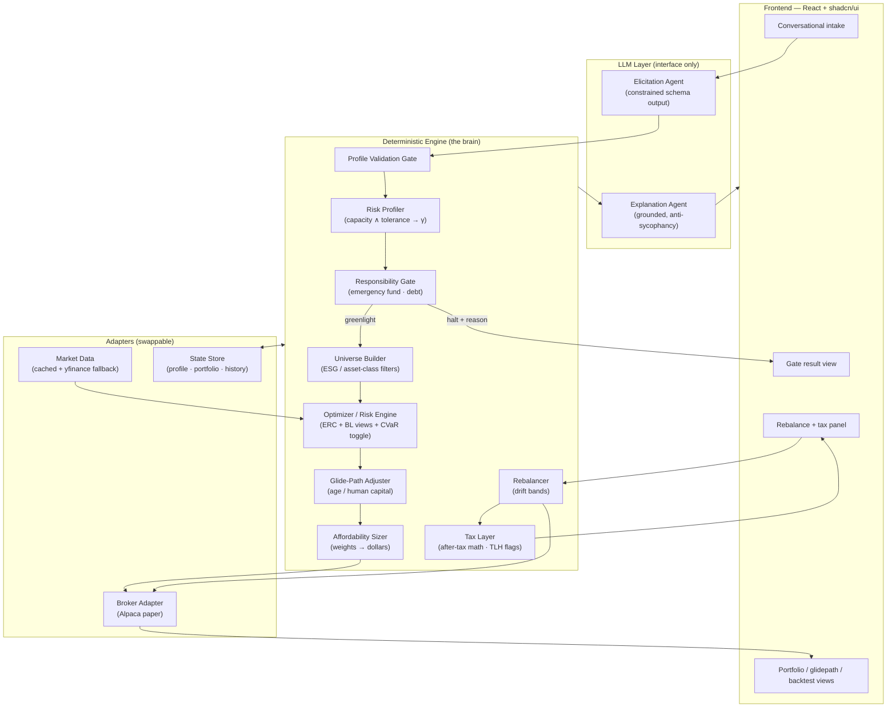
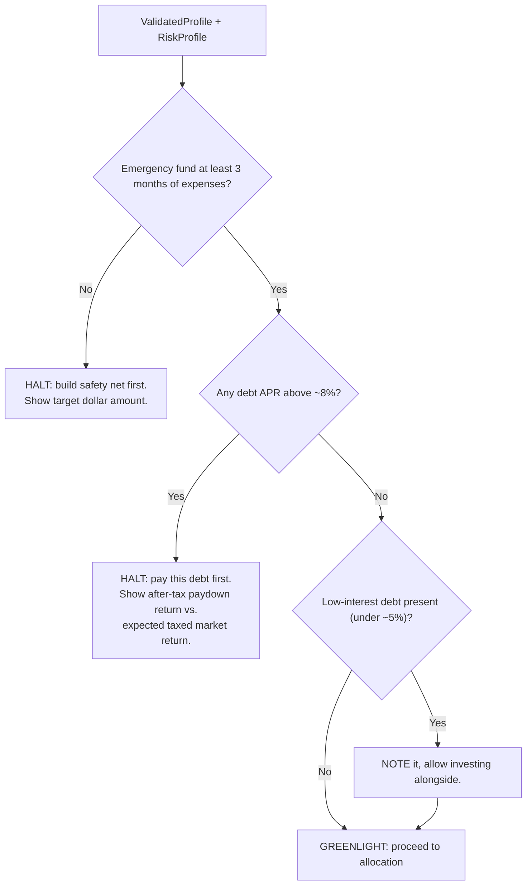

# Greenlight — End-to-End System Design

**Status:** Design (pre-implementation) · **Date:** 2026-05-30 · **Audience:** Greenlight team

This document is the architectural source of truth. It describes how a user's financial picture is ingested, gated, profiled, optimized, sized, executed, maintained, and re-run — and where the boundaries between components sit. Language and library choices are deliberately kept abstract; where a specific tool is named it is a *reference implementation*, not a requirement.

For the research behind each decision, see [02-research-foundations.md](./02-research-foundations.md). For a worked example tracing a user through the whole system, see [03-dataflow-usecase.md](./03-dataflow-usecase.md).

---

## 1. Thesis & design principles

Greenlight inverts the robo-advisor default. Instead of "you should invest, here's how much," it asks **"should you be investing at all right now?"** first, and is willing to answer *no*.

Five principles govern every component:

1. **Responsibility-first.** The responsibility gate (§5) runs before optimization and can halt the pipeline. It is pure logic with no external dependencies.
2. **LLM elicits and explains; the deterministic engine decides.** The conversational layer populates a typed, validated profile and narrates results. It never computes an allocation, a dollar figure, or a risk score. (Rationale and citations: research doc §1.)
3. **Capacity caps tolerance.** Risk *capacity* (objective ability to bear loss) and risk *tolerance* (subjective willingness) are measured independently; the usable profile is `min(capacity, tolerance)`. (Research doc §3.)
4. **Robust-by-construction optimization.** Equal-risk-contribution core with shrinkage-stabilized covariance, not naive mean-variance. (Research doc §5.)
5. **Demo-safe by design.** Paper trading, cached prices, pre-seeded state, recorded fallbacks (§13).

---

## 2. System at a glance



**The hard boundary** runs between the LLM Layer and the Deterministic Engine. Everything the user *sees as a number* originates in the engine; the LLM only converts natural language ↔ typed data and explains. This boundary is what makes the system auditable and defensible.

---

## 3. Component catalog

Each component is described by **what it does**, **its input → output contract** (abstract, language-agnostic), and **what it depends on**. Components communicate only through these contracts so each can be built and tested in isolation.

### 3.1 Elicitation Agent (LLM)
- **Does:** Conducts a natural conversation to gather the user's financial picture and risk signals. Asks scenario questions ("if your portfolio dropped 20% in a year, what would you do?"), detects contradictions between stated and revealed preferences, and asks follow-ups to resolve them.
- **In → Out:** free-form dialogue turns → a partially/fully populated `UserProfile` (typed schema, §4) with per-field `confidence` and `uncertainty_flags`.
- **Depends on:** the `UserProfile` schema and a fixed elicitation rubric (which constructs to cover). **Does not** depend on the engine.
- **Constraints:** structured/function-call output only — no free-form numbers; neutral, non-leading phrasing; randomized/fixed question order to control framing effects. (Research doc §1, §2.)

### 3.2 Profile Validation Gate (deterministic)
- **Does:** Range-checks, completeness-checks, and consistency-checks the extracted profile before it reaches the engine. Out-of-range or internally contradictory profiles are rejected and routed back to dialogue.
- **In → Out:** raw `UserProfile` → `ValidatedProfile` **or** a list of `clarification_requests` (which the Elicitation Agent voices).
- **Depends on:** schema + validation rules. This is the airlock between LLM and engine.

### 3.3 Risk Profiler (deterministic)
- **Does:** Computes the two risk axes and combines them.
  - *Tolerance axis:* scores the Grable-Lytton-style instrument + loss-aversion probe → a tolerance score → an implied CRRA risk-aversion coefficient **γ**, with a confidence band (not a point).
  - *Capacity axis:* objective 0–100 from horizon, human-capital beta (income stability), emergency-fund months, savings rate, and debt burden.
  - *Combine:* usable profile = `min(capacity, tolerance)`.
- **In → Out:** `ValidatedProfile` → `RiskProfile { gamma, gamma_band, capacity_score, tolerance_score, binding_axis }`.
- **Depends on:** scoring tables + γ-mapping (research doc §2, §3).

### 3.4 Responsibility Gate (deterministic) — *the spine*
- **Does:** Decides whether the user should invest **at all**, before any optimization. Runs ordered checks (§5) and can **halt** the pipeline with a reason and the supporting math.
- **In → Out:** `ValidatedProfile` + `RiskProfile` → `GateResult { status: greenlight | halt, reason?, math?, recommended_action? }`.
- **Depends on:** nothing external — pure logic. Built first.

### 3.5 Universe Builder (deterministic)
- **Does:** Produces the candidate investable set by applying universe preference (ETFs / stocks / mix), sector/theme tilts, and **ESG exclusions**. Maps the user into asset-class sleeves: US equity, international equity, bonds, TIPS, **gold**, REITs.
- **In → Out:** `ValidatedProfile.preferences` → `Universe { tickers[], sleeves{}, excluded[] }`.
- **Depends on:** a curated ticker→sleeve→ESG-tag reference table and the price cache.

### 3.6 Optimizer / Risk Engine (deterministic) — *the technical centerpiece*
- **Does:** Turns the risk profile into target weights over the universe.
  - **Core:** Equal-Risk-Contribution (risk parity) on a **Ledoit-Wolf shrinkage** covariance matrix — robust, needs no return forecasts.
  - **Risk sizing:** scale the ERC portfolio to the user's **target volatility** (derived from γ); equivalently exposed as a single risk dial.
  - **Preferences layer:** **Black-Litterman** — ESG/asset-class tilts enter as *views* with tunable confidence, so values bend the portfolio without producing extreme weights.
  - **Toggle:** **mean-CVaR** (minimize expected tail loss) for the "minimize the loss you actually fear" mode.
  - **Cautionary baseline only:** naive max-Sharpe mean-variance, shown in the backtest as the "before" that the robust methods beat.
- **In → Out:** `RiskProfile` + `Universe` + price history → `TargetWeights { ticker: weight }` + `RiskMetrics { vol, expected_shortfall, contributions }`.
- **Depends on:** market data, covariance estimator. (Research doc §5, §6.)

### 3.7 Glide-Path Adjuster (deterministic)
- **Does:** Applies the age / human-capital lifecycle adjustment to the equity-vs-bond split — young + bond-like human capital → higher equity; near retirement → a U-shaped "bond tent" rather than naive linear decline.
- **In → Out:** `TargetWeights` + `{ age, horizon, human_capital_beta }` → glide-adjusted `TargetWeights`.
- **Depends on:** glidepath model (research doc §3).

### 3.8 Affordability Sizer (deterministic)
- **Does:** Converts target weights into concrete dollar amounts against capital on hand; applies fractional-share logic; chooses lump-sum vs. dollar-cost-averaging based on surplus; produces a contribution schedule.
- **In → Out:** glide-adjusted `TargetWeights` + `{ capital_on_hand, monthly_surplus }` → `OrderPlan { buys[], schedule, method }`.
- **Depends on:** current prices, broker fractional-share capability.

### 3.9 Broker Adapter (external, swappable)
- **Does:** Places orders and reads back positions/value. Deliberately minimal: **place-order** and **read-positions** only.
- **In → Out:** `OrderPlan` → `Fills[]`; `()` → `Positions[]`, `PortfolioValue`.
- **Reference impl:** Alpaca **paper** account. Interface is broker-agnostic so a different broker (or a pure simulator) can be dropped in.

### 3.10 Rebalancer (deterministic)
- **Does:** On a quarterly cadence (and on any profile/preference change), checks each position's drift against its band (±5 percentage points). Within band → steer the *next contribution* toward underweight names (no trade, no fee). Breached → emit the minimal corrective trade.
- **In → Out:** `Positions` + `TargetWeights` → `RebalanceDecision { steer | trade, actions[] }`.
- **Depends on:** broker adapter, prices. A "fast-forward a quarter" simulated clock drives drift in the demo.

### 3.11 Tax Layer (deterministic, advisory)
- **Does:** Two lightweight pieces.
  1. *In the gate:* folds the user's tax situation into the debt-vs-invest math (debt paydown return is tax-free; market gains are taxed).
  2. *At rebalance / year-end (read-only):* flags **harvestable losses** ("$X in positions below cost basis you could sell to offset gains") and surfaces the **wash-sale caveat** (don't repurchase a substantially identical security within 30 days). Displays; **does not** auto-execute.
- **In → Out:** `Positions` + `cost_basis` + `{ filing_status, bracket }` → `TaxReport { harvestable[], wash_sale_warnings[], after_tax_notes }`.
- **Depends on:** cost-basis tracking in the state store. (Research doc §7, §8. **TurboTax export is roadmap**, not MVP.)

### 3.12 Explanation Agent (LLM)
- **Does:** Narrates the engine's outputs and the parameter mapping in plain language, grounded strictly in the engine's numbers, with an anti-sycophancy system prompt (prioritize accuracy over agreement). Explanation only — introduces no new numbers.
- **In → Out:** any engine output object → human-readable rationale + citations to the inputs.

### 3.13 State Store (external)
- **Does:** Persists `UserProfile`, current `TargetWeights`, `Positions`, `cost_basis`, and an event history (every gate decision, allocation, rebalance, profile change) for audit and the "re-run" feature.

---

## 4. Core data contract: `UserProfile`

The single typed object the LLM populates and the engine consumes. Kept abstract (types, not a language):

```
UserProfile {
  # Financials
  household_income: money
  monthly_expenses: money
  capital_on_hand: money
  emergency_fund: money
  debts: [ { balance: money, apr: percent, kind: enum } ]

  # Lifecycle
  age: int
  horizon_years: int            # distance to retirement / goal
  goals: [ enum(retirement|home|education|...) ]
  dependents: int
  filing_status: enum

  # Risk signals (tolerance axis)
  risk_instrument_responses: [...]     # Grable-Lytton-style items
  loss_scenario_response: enum         # "portfolio drops 20%" behavior
  loss_aversion_probe: number          # smallest win to accept 50/50 bet

  # Capacity inputs
  income_stability: enum(bond_like|mixed|stock_like)

  # Preferences
  universe_pref: enum(etf|stock|mix)
  esg_exclusions: [tag]
  sector_theme_tilts: [tag]

  # Meta (per field)
  confidence: map<field, 0..1>
  uncertainty_flags: [field]
}
```

Every downstream object (`RiskProfile`, `GateResult`, `TargetWeights`, `OrderPlan`, `RebalanceDecision`, `TaxReport`) is similarly typed and versioned in the state store.

---

## 5. The responsibility gate (ordered logic)

Runs **before** optimization. First failing check halts the pipeline.



- **Emergency-fund check:** liquid reserves < 3 months of essential expenses → halt with the target dollar figure.
- **High-interest debt check:** any APR above ~8% → halt. The displayed math compares the **guaranteed, tax-free** return from paydown (= the APR) against the **uncertain, taxed** expected market return. (Research doc §4.)
- **Low-interest debt:** noted, investing allowed alongside.
- **Thresholds (8% / 5% / 3 months) are configurable constants**, defaulted from the literature and the user's tax bracket.

The gate is the first thing built and the most heavily tested — it is the differentiator and has zero external dependencies.

---

## 6. Reallocation mechanism

Two triggers, one mechanism:

1. **Time trigger:** quarterly (the "fast-forward a quarter" button in the demo).
2. **Event trigger:** any change to the validated profile or preferences re-runs the pipeline from the gate forward.

Mechanism = **drift-band rebalancing** (not calendar-forced trading): a position is only traded when it breaches its ±5pp band. Within-band corrections are made by **steering the next contribution** toward underweight sleeves, which avoids needless transaction costs and tax events. (Drift-band over periodic-forced rebalancing is a deliberate cost/tax choice.)

---

## 7. Loan linking, payments & wealth management

- **Loan ingestion (MVP):** debts are entered as `{ balance, APR, kind }` during intake. The gate and tax layer consume them directly. No bank linking required for the demo.
- **The gate is the wealth-management core:** by refusing to invest behind high-APR debt or an absent safety net, Greenlight's primary "wealth management" act is *preventing value destruction*, which is both the benevolence story and pure logic.
- **"Pay off debt with capital gains":** when the user has realized or realizable gains and remaining (low-interest, gate-passed) debt, the system presents an **after-tax** comparison — realizing gains is a taxable event, so the engine weighs after-tax proceeds against the debt's APR before recommending paydown from gains. (Traced in the use case doc, T4.)
- **Payments & auto-refresh (ROADMAP):** automatic contribution transfers, scheduled debt payments, and live account refresh are explicitly out of MVP scope. The demo *simulates* contributions and payoff via re-input. Real money movement is a post-hackathon, compliance-gated feature.

---

## 8. Execution model

- **Paper only.** Orders route to an Alpaca **paper** account through the broker adapter. The adapter exposes only `place_order` and `read_positions` — no margin, options, or fancy order types.
- **Broker-agnostic.** The adapter interface lets us swap in a pure in-process simulator if the network is unavailable during the demo (see §13).
- **Read-back loop:** after placing orders we read positions and portfolio value to render the live portfolio view and confirmations.

---

## 9. Backtesting (credibility proof)

The backtest is a first-class engine feature, not an afterthought — it is how we prove the risk engine works.

- **Method:** walk-forward / out-of-sample. Estimate covariance on a rolling window; rebalance quarterly; evaluate only on subsequent unseen data. Never tune on the test window.
- **Benchmarks:** 1/N equal-weight (the honest hurdle), classic 60/40, and a target-date fund.
- **Metrics:** Sharpe **and Deflated Sharpe**, Sortino, max drawdown, Calmar.
- **Anti-overfitting hygiene:** keep the number of tried configurations small and *state it*; prefer parameter-light methods (ERC) that have little to overfit.

(Full citations: research doc §5, §7.)

---

## 10. Frontend (React + shadcn/ui)

- **Conversational intake** with a live, transparent panel showing the **extracted parameters** as they're captured — judges see the LLM↔engine boundary directly.
- **Gate result view** — the halt/greenlight screen with the math rendered, not just a verdict. This is the emotional centerpiece of the demo.
- **Portfolio views** — animated allocation donut, glidepath curve, and the out-of-sample backtest equity + drawdown charts.
- **Rebalance + tax panel** — drift bars per sleeve, the rebalance decision, and the read-only tax-loss-harvest flags with the wash-sale caveat.
- **Re-run** — edit inputs and watch the gate flip (pay off the debt → greenlight unlocks). The second judgment moment on stage.

---

## 11. Failure modes & error handling

| Risk | Mitigation |
|------|-----------|
| LLM emits an out-of-range or contradictory profile | Profile Validation Gate (§3.2) rejects and routes back to dialogue |
| LLM hallucinates numbers / is sycophantic | Hard LLM↔engine boundary; constrained schema output; anti-sycophancy prompt; engine owns all numbers |
| Optimizer produces extreme/degenerate weights | ERC + shrinkage by construction resists this; weight caps + long-only constraints; BL keeps tilts bounded |
| Market-data API unavailable | Cached price CSVs (fetched the night before); yfinance fallback |
| Broker API down during demo | In-process broker simulator behind the same adapter; recorded fallback |
| Covariance matrix ill-conditioned | Ledoit-Wolf shrinkage; minimum-history guardrail |
| Backtest looks too good (overfit) | Deflated Sharpe + walk-forward + stated config count |

---

## 12. Compliance & disclaimer posture

This is a demonstration, not a registered advisory service. Per SEC robo-adviser guidance (research doc §9), the UI persistently shows:

- "Demonstration only — **not** financial, investment, tax, or legal advice; not an offer or recommendation to buy/sell any security."
- "Not a registered investment adviser; no fiduciary or advisory relationship is created."
- "The AI **elicits and explains**; a deterministic engine produces the figures. Outputs are illustrative and may be inaccurate — verify with a licensed professional."
- Plain-language note on how the engine works and its assumptions/limitations.

The conversational follow-up on contradictory answers is also a deliberate, citable response to the SEC's specific criticism of questionnaire-only robo-advisors.

---

## 13. Demo-safety checklist

- [ ] Prices for the full universe cached to CSV the night before.
- [ ] Alpaca paper account pre-seeded; in-process simulator ready as fallback behind the same adapter.
- [ ] A recorded walk-through of the full happy path in case of total network loss.
- [ ] The gate, profiler, optimizer, and backtest run fully offline against cached data.
- [ ] Two scripted personas ready: one that **halts** (debt/no-savings) and one that **greenlights**, plus the re-input that flips the first.

---

## 14. Scope: MVP vs. Roadmap

| In MVP (demo) | Roadmap (post-hackathon) |
|---------------|--------------------------|
| Conversational intake → typed profile | Bank/account linking & auto-refresh |
| Responsibility gate (the spine) | Automatic contribution transfers & debt payments |
| Two-axis risk profiling → γ | TurboTax / tax-form export |
| ERC + BL + CVaR optimizer, glidepath, sizing | Live (non-paper) brokerage trading |
| Alpaca paper execution + read-back | Multi-account / household optimization |
| Drift-band rebalancing (simulated clock) | Auto-executed tax-loss harvesting |
| Read-only tax-loss flagging + wash-sale caveat | Continuous monitoring & alerts |
| Out-of-sample backtest vs. benchmarks | Regulatory registration (RIA) |
| Re-run on updated status | |

---

## 15. How this maps to the judging criteria

- **Social welfare / benevolence:** the gate refuses to invest when it would hurt the user — anti-predatory by design; shows the math.
- **Technical complexity:** two-axis risk model → γ, robust ERC/CVaR optimization with shrinkage and Black-Litterman views, walk-forward backtest with overfitting-aware metrics, LLM-as-interface architecture.
- **Clean UI polish:** React + shadcn, animated allocation/glidepath/backtest views, transparent parameter panel, the dramatic gate-flip moment.
- **Research backing:** every decision cited (see [02-research-foundations.md](./02-research-foundations.md)).
