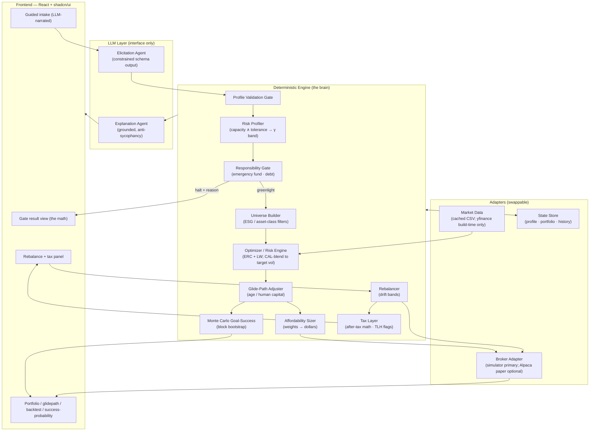
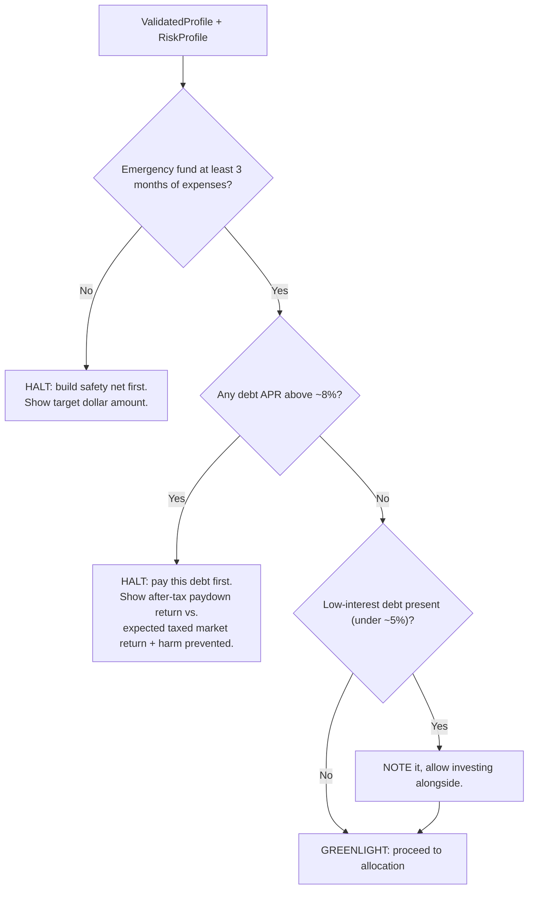

# Greenlight — End-to-End System Design

**Status:** Design v2 (post-review) · **Date:** 2026-05-30 · **Audience:** Greenlight team

This document is the architectural source of truth. It describes how a user's financial picture is ingested, gated, profiled, optimized, projected, sized, executed, maintained, and re-run — and where the boundaries between components sit. Language is kept abstract; where a specific tool is named it is a committed *reference implementation*.

**v2 changes** (from the three-agent design review): fixed the γ→volatility→ERC math (it was conflating two different controls); committed **riskfolio-lib** for true risk parity (PyPortfolioOpt has no ERC); added an explicit Black-Litterman equilibrium prior; added a **Monte Carlo goal-success engine** as a headline feature; sharpened the ML stance (no return prediction); made the backtest honest (transaction costs, Deflated Sharpe with trial count, modest claims); reframed the halt as **deferred conversion**. The 24-hour build plan and demo script now live in [04-build-and-demo.md](./04-build-and-demo.md).

For the research behind each decision, see [02-research-foundations.md](./02-research-foundations.md). For a worked example, see [03-dataflow-usecase.md](./03-dataflow-usecase.md).

---

## 1. Thesis & design principles

Greenlight inverts the robo-advisor default. Instead of "you should invest, here's how much," it asks **"should you be investing at all right now?"** first, and is willing to answer *no*.

Six principles govern every component:

1. **Responsibility-first.** The responsibility gate (§5) runs before optimization and can halt the pipeline. It is pure logic with no external dependencies.
2. **LLM elicits and explains; the deterministic engine decides.** The conversational layer populates a typed, validated profile and narrates results. It never computes an allocation, a dollar figure, or a risk score.
3. **Capacity caps tolerance.** Risk *capacity* (objective ability to bear loss) and risk *tolerance* (subjective willingness) are measured independently; the usable profile is `min(capacity, tolerance)`.
4. **Robust-by-construction optimization.** Equal-risk-contribution core with shrinkage-stabilized covariance; **no return forecasts**, no faked alpha.
5. **The halt is deferred conversion, not refusal.** Telling a user "not yet" is not turning away a customer — it is a trust-first acquisition funnel. The gate-flip *is* the conversion event. This is a business-model strength, not a non-product.
6. **Demo-safe by design.** Paper/simulated execution, cached prices, pre-seeded state, offline-capable, recorded fallback (see [04-build-and-demo.md](./04-build-and-demo.md)).

---

## 2. System at a glance



**The hard boundary** runs between the LLM Layer and the Deterministic Engine. Everything the user *sees as a number* originates in the engine; the LLM only converts natural language ↔ typed data and explains. This boundary is what makes the system auditable and defensible.

---

## 3. Component catalog

Each component is described by **what it does**, **its input → output contract** (abstract), and **what it depends on**. Components communicate only through these contracts so each can be built and tested in isolation. The MVP build verdict for each (live / pre-baked / cut) is in [04-build-and-demo.md](./04-build-and-demo.md).

### 3.1 Elicitation Agent (LLM)
- **Does:** Drives a guided, LLM-narrated intake. Asks a small number of scenario questions ("if your portfolio dropped 20% in a year, what would you do?") and detects contradictions between stated and revealed preferences, asking a follow-up to resolve them.
- **In → Out:** dialogue / form turns → a populated `UserProfile` (typed, §4) with per-field `confidence` and `uncertainty_flags`.
- **Depends on:** the `UserProfile` schema. **Not** the engine.
- **Constraints:** structured/function-call output only — no free-form numbers; neutral, non-leading phrasing; controlled question order. (Research §1, §2.) In the MVP this is a **guided form with a narrated veneer**, not free-form dialogue (reliability — see build doc).

### 3.2 Profile Validation Gate (deterministic)
- **Does:** Range-, completeness-, and consistency-checks the extracted profile before it reaches the engine. Failing profiles route back to dialogue.
- **In → Out:** raw `UserProfile` → `ValidatedProfile` **or** `clarification_requests`.
- **Depends on:** schema + validation rules. The airlock between LLM and engine.

### 3.3 Risk Profiler (deterministic)
- **Does:** Computes the two risk axes and combines them.
  - *Tolerance axis:* scores the Grable-Lytton-style instrument + loss-aversion probe → an implied CRRA risk-aversion coefficient **γ**, reported as a **band (γ_low, γ_mid, γ_high)** reflecting measurement error, not a point.
  - *Capacity axis:* objective 0–100 from horizon, human-capital beta (income stability), emergency-fund months, savings rate, debt burden.
  - *Combine:* usable profile = `min(capacity, tolerance)`.
- **In → Out:** `ValidatedProfile` → `RiskProfile { gamma_band, capacity_score, tolerance_score, binding_axis }`.
- **Depends on:** a **disclosed** score→γ lookup table (Research §2 — must be calibrated and shown, not asserted).

### 3.4 Responsibility Gate (deterministic) — *the spine*
- **Does:** Decides whether the user should invest **at all**, before any optimization. Runs ordered checks (§5) and can **halt** with a reason and the supporting math.
- **In → Out:** `ValidatedProfile` + `RiskProfile` → `GateResult { status, reason?, math?, recommended_action?, harm_prevented? }`.
- **Depends on:** nothing external — pure logic. **Built first, tested hardest.**

### 3.5 Universe Builder (deterministic)
- **Does:** Produces the candidate set by applying universe preference (ETFs / stocks / mix), sector/theme tilts, and **ESG exclusions**. Maps into asset-class sleeves: US equity, international equity, bonds, TIPS, **gold**, REITs.
- **In → Out:** `ValidatedProfile.preferences` → `Universe { tickers[], sleeves{}, market_weights{}, excluded[] }`. (`market_weights` are the sleeve market-cap weights needed as the Black-Litterman prior — §3.6.)
- **Depends on:** a curated ticker→sleeve→ESG-tag reference table and the price cache.

### 3.6 Optimizer / Risk Engine (deterministic) — *the technical centerpiece*
Committed library: **riskfolio-lib** (native true risk parity, mean-CVaR, Black-Litterman, shrinkage — all on CVXPY). PyPortfolioOpt is a fallback for Ledoit-Wolf/BL only; **it has no true ERC** (only HRP).

- **Core allocator:** **Equal-Risk-Contribution (risk parity)** on a **Ledoit-Wolf linear shrinkage** covariance matrix. Produces the *shape* of the risky sleeve. **Needs no expected-return estimates.**
- **Risk sizing (corrected mechanism).** γ is **not** an input to the ERC solve. Instead: the risk dial γ (with its band) maps to a **target volatility** `σ_target`; we hit `σ_target` by **blending the ERC risky portfolio with the bond/cash sleeve along the capital-allocation line** (long-only, de-risk only — we do not lever). The achievable-volatility range is therefore asymmetric (we can lower vol by adding bonds/cash, not raise it past the all-risky ERC point). γ is presented as a *labeled risk dial → target vol*, decoupled from any return forecast. *(This replaces the v1 claim that target vol "maps one-to-one to γ" — that equivalence is a mean-variance/Merton property that requires an expected-return estimate, which ERC deliberately avoids.)*
- **Preferences layer:** **Black-Litterman.** The prior is the **market-cap equilibrium** reverse-optimized from the sleeve `market_weights` (§3.5) — this *must* be specified or BL has nothing to tilt from. ESG/asset-class preferences enter as *views* (P, Q, Ω) with tunable confidence, bending weights gently without extreme tilts.
- **Downside-risk toggle:** **mean-CVaR** (Rockafellar-Uryasev) computed on a **historical (or bootstrap) scenario set** — note CVaR needs return *scenarios*, not just the covariance matrix.
- **Robustness ensemble (light):** optionally average ERC + minimum-variance + maximum-diversification weights (all covariance-only) and use the cross-model weight dispersion as part of the risk band. *(We deliberately skip Michaud resampling — contested; see Research §5.)*
- **Cautionary baseline only:** naive max-Sharpe mean-variance, shown in the backtest as the "before" the robust methods beat.
- **In → Out:** `RiskProfile` + `Universe` + price history → `TargetWeights` (+ band) + `RiskMetrics { vol, expected_shortfall, risk_contributions }`.
- **Depends on:** market data, covariance estimator. (Research §5.)

### 3.7 Glide-Path Adjuster (deterministic)
- **Does:** Applies the age / human-capital lifecycle adjustment to the equity-vs-bond split — young + bond-like human capital → higher equity. MVP uses a **linear age tilt**; the U-shaped "bond tent" near retirement is presented as research, and its benefit is *demonstrated* by the Monte Carlo engine (§3.8) rather than asserted.
- **In → Out:** `TargetWeights` + `{ age, horizon, human_capital_beta }` → glide-adjusted `TargetWeights`.
- **Depends on:** glidepath model (Research §3).

### 3.8 Monte Carlo Goal-Success Engine (deterministic) — *headline feature*
- **Does:** Simulates many wealth paths over the user's horizon (with contributions) to output **P(terminal wealth ≥ goal)** — "you have an X% chance of funding retirement" — plus a fan chart of outcome percentiles. Also surfaces a 5th-percentile ("bad case") outcome and is the mechanism that **proves** the glide-path choice reduces failure probability.
- **Generator:** **stationary block bootstrap** (Politis-Romano) of historical sleeve returns — preserves fat tails and short-horizon serial dependence. A **Gaussian-GBM toggle** is shown side-by-side specifically to demonstrate that Gaussian is *optimistically biased in the left tail* (Pfau 2010) — the contrast is itself a technical point.
- **In → Out:** glide-adjusted `TargetWeights` + `{ horizon, contributions, goal }` + return history → `Projection { p_success, percentile_paths, bad_case }`.
- **Depends on:** return history (cached). ~tens of lines of NumPy.

### 3.9 Affordability Sizer (deterministic)
- **Does:** Converts target weights into dollar amounts against capital on hand; applies fractional-share logic; chooses lump-sum vs. DCA from surplus; produces a contribution schedule.
- **In → Out:** glide-adjusted `TargetWeights` + `{ capital_on_hand, monthly_surplus }` → `OrderPlan { buys[], schedule, method }`.

### 3.10 Broker Adapter (external, swappable)
- **Does:** Places orders and reads back positions/value. Minimal: **place-order** and **read-positions** only.
- **In → Out:** `OrderPlan` → `Fills[]`; `()` → `Positions[]`, `PortfolioValue`.
- **Reference impl:** an **in-process simulator is the primary path**; an Alpaca **paper** adapter behind the same interface is the optional "swappable, here's the interface" talking point. (A positions table looks identical regardless of source; live brokerage adds network risk with no demo payoff.)

### 3.11 Rebalancer (deterministic)
- **Does:** On a quarterly cadence (and on any profile/preference change), checks each position's drift vs. its band (±5pp). Within band → **steer the next contribution** toward underweight names (no trade). Breached → emit the minimal corrective trade.
- **In → Out:** `Positions` + `TargetWeights` → `RebalanceDecision { steer | trade, actions[] }`.
- **Depends on:** broker adapter, prices. A "fast-forward a quarter" simulated clock drives drift in the demo.

### 3.12 Tax Layer (deterministic, advisory)
- **Does:** (1) *In the gate:* folds the user's tax situation into the debt-vs-invest math (paydown is tax-free; gains are taxed). (2) *At rebalance / year-end (read-only):* flags **harvestable losses** and surfaces the **wash-sale caveat** (no substantially-identical repurchase within 30 days). Displays; **does not** auto-execute.
- **In → Out:** `Positions` + `cost_basis` + `{ filing_status, bracket }` → `TaxReport { harvestable[], wash_sale_warnings[], after_tax_notes }`.
- **Depends on:** cost-basis tracking. (Research §7, §8. **TurboTax export is roadmap.**)

### 3.13 Explanation Agent (LLM)
- **Does:** Narrates the engine's outputs and the parameter mapping in plain language, grounded strictly in the engine's numbers, with an anti-sycophancy system prompt. Explanation only — no new numbers.
- **In → Out:** any engine output object → human-readable rationale + citations to the inputs.

### 3.14 State Store (external)
- **Does:** Persists `UserProfile`, `TargetWeights`, `Positions`, `cost_basis`, and an event history (every gate decision, allocation, rebalance, profile change) for audit and the "re-run" feature.

---

## 4. Core data contract: `UserProfile`

The single typed object the LLM populates and the engine consumes:

```
UserProfile {
  # Financials
  household_income: money
  monthly_expenses: money
  capital_on_hand: money
  emergency_fund: money
  debts: [ { balance: money, apr: percent, kind: enum } ]

  # Lifecycle
  age: int
  horizon_years: int
  goals: [ enum(retirement|home|education|...) ]
  goal_target: money
  dependents: int
  filing_status: enum

  # Risk signals (tolerance axis)
  risk_instrument_responses: [...]     # Grable-Lytton-style items
  loss_scenario_response: enum         # "portfolio drops 20%" behavior
  loss_aversion_probe: number          # smallest win to accept 50/50 bet

  # Capacity inputs
  income_stability: enum(bond_like|mixed|stock_like)

  # Preferences
  universe_pref: enum(etf|stock|mix)
  esg_exclusions: [tag]
  sector_theme_tilts: [tag]

  # Meta (per field)
  confidence: map<field, 0..1>
  uncertainty_flags: [field]
}
```

Every downstream object is similarly typed and versioned in the state store. **Freeze this contract first** — every workstream depends on it.

---

## 5. The responsibility gate (ordered logic)

Runs **before** optimization. First failing check halts the pipeline.



- **Emergency-fund check:** liquid reserves < 3 months of essential expenses → halt with the target dollar figure.
- **High-interest debt check:** any APR above ~8% → halt. The displayed math compares the **guaranteed, tax-free** return from paydown (= the APR) against the **uncertain, taxed** expected market return, and **quantifies the harm prevented** ("investing behind this debt would cost you ~$X/yr"). (Research §4.)
- **Low-interest debt:** noted, investing allowed alongside.
- **Thresholds (8% / 5% / 3 months) are configurable constants**, defaulted from the literature and the user's tax bracket.

The gate is the first thing built and the most heavily tested — it is the differentiator and has zero external dependencies. **Framing:** a halt is *deferred conversion* — Greenlight keeps coaching the user and converts them the day the gate flips (§1, principle 5).

---

## 6. Reallocation mechanism

Two triggers, one mechanism:

1. **Time trigger:** quarterly (the "fast-forward a quarter" button in the demo).
2. **Event trigger:** any change to the validated profile or preferences re-runs the pipeline from the gate forward.

Mechanism = **drift-band rebalancing** (not calendar-forced trading): a position is only traded when it breaches its ±5pp band; within-band corrections steer the next contribution toward underweight sleeves, avoiding needless transaction costs and taxable events.

---

## 7. Loan linking, payments & wealth management

- **Loan ingestion (MVP):** debts entered as `{ balance, APR, kind }`; the gate and tax layer consume them directly. No bank linking for the demo.
- **The gate is the wealth-management core:** refusing to invest behind high-APR debt or an absent safety net is itself the primary wealth-management act — preventing value destruction.
- **"Pay off debt with capital gains":** when the user has realizable gains and remaining (low-interest, gate-passed) debt, the system shows the **after-tax** comparison — realizing gains is taxable, so net proceeds are weighed against the debt's APR. (Use case T4.)
- **Payments & auto-refresh (ROADMAP):** automatic transfers, scheduled debt payments, and live account refresh are out of MVP scope; the demo simulates contributions/payoff via re-input.

---

## 8. Execution model

- **Simulated by default.** Orders route to an in-process simulator through the broker adapter (`place_order`, `read_positions` only). An Alpaca **paper** adapter is available behind the same interface but is not on the live demo path.
- **Read-back loop:** after placing orders we read positions and portfolio value to render the live portfolio view and confirmations.

---

## 9. Backtesting (credibility proof)

A first-class engine feature — how we prove the risk engine works — **computed offline and rendered from static results** (never run live).

- **Method:** walk-forward / out-of-sample. Rolling 36–60-month covariance window; re-estimate and rebalance quarterly; evaluate only on subsequent unseen data; never tune on the test window.
- **Transaction costs:** charge ~10 bps per trade, or the comparison vs. 1/N is unfair.
- **Benchmarks:** 1/N equal-weight (the honest hurdle), 60/40, and a target-date fund.
- **Metrics:** Sharpe **and Deflated Sharpe** (computed with the **logged number of configurations tried, N** — the whole point of DSR), Sortino, max drawdown, Calmar.
- **Honest claim:** ERC's defensible win is "**better drawdown / Sortino / Calmar and lower turnover**," *not* "beats 1/N on Sharpe" — the literature (DeMiguel et al. 2009) says the latter usually can't be claimed honestly.
- **Data/ETFs:** liquid long-history sleeve proxies (e.g. VTI/SPY, VEA/EFA, AGG/BND, **TIP**, **GLD**, **VNQ**); choose the window so all series cover it, or backfill with index proxies and disclose it.

(Citations: Research §5, §7.)

---

## 10. Frontend (React + shadcn/ui)

UI polish is a heavily-weighted, first-impression judging axis — treat it as a first-class workstream, not a thin layer. Build **three screens to perfection** rather than eight to mediocrity:

1. **Guided intake** with a live, transparent panel showing the **extracted parameters** populating as the user answers — judges see the LLM↔engine boundary directly, and see the contradiction-catch fire.
2. **Gate result view** — the halt/greenlight screen with the math and **harm-prevented dollar figure** rendered. The emotional centerpiece. The **red→green gate-flip animation** is the product's signature moment and visual identity.
3. **Portfolio view** — animated allocation donut + the **Monte Carlo success-probability fan chart** ("X% chance") + the out-of-sample backtest equity/drawdown charts with the Deflated Sharpe number visible.

The rebalance + tax panel is a fourth, lower-priority screen (drift bars, rebalance decision, read-only TLH flags + wash-sale caveat).

---

## 11. Failure modes & error handling

| Risk | Mitigation |
|------|-----------|
| LLM emits out-of-range/contradictory profile | Profile Validation Gate (§3.2) rejects, routes back to dialogue |
| LLM hallucinates numbers / is sycophantic | Hard LLM↔engine boundary; constrained schema output; anti-sycophancy prompt; engine owns all numbers |
| Optimizer produces extreme/degenerate weights | ERC + shrinkage resists this; weight caps + long-only; BL keeps tilts bounded |
| Market-data API unavailable / rate-limited | yfinance is **build-time only** (rate-limited/IP-banned in 2026); cached CSVs are the only runtime path |
| Broker API issues | In-process simulator is the primary path |
| Covariance ill-conditioned | Ledoit-Wolf shrinkage; minimum-history guardrail |
| Backtest looks too good (overfit) | Deflated Sharpe + logged trial count + walk-forward; modest claims |
| Monte Carlo overstates success | Block bootstrap (not Gaussian) as the headline; Gaussian shown only as the "optimistic" contrast |
| Solver missing on fresh install | Don't pin `solver="ECOS"` (dropped in CVXPY 1.6); use default Clarabel/SCS; pin deps in a lockfile |

---

## 12. Compliance & disclaimer posture

A demonstration, not a registered advisory service. Per SEC robo-adviser guidance (Research §9):

- "Demonstration only — **not** financial, investment, tax, or legal advice; not an offer or recommendation to buy/sell any security."
- "Not a registered investment adviser; no fiduciary or advisory relationship is created."
- "The AI **elicits and explains**; a deterministic engine produces the figures. Outputs are illustrative and may be inaccurate — verify with a licensed professional."

On stage, one persistent footer line is enough; the full posture lives here and in the README. The conversational contradiction-follow-up is also a deliberate, citable response to the SEC's criticism of questionnaire-only robo-advisors.

---

## 13. Scope: MVP vs. Roadmap

| In MVP (demo) | Roadmap (post-hackathon) |
|---------------|--------------------------|
| Guided LLM intake → typed profile | Free-form conversational intake; bank linking & auto-refresh |
| Responsibility gate (the spine) | Automatic contribution transfers & debt payments |
| Two-axis risk profiling → γ band | TurboTax / tax-form export |
| ERC + Ledoit-Wolf optimizer (live); BL + CVaR (pre-baked toggles) | DCC-GARCH / regime-switching covariance; nonlinear shrinkage |
| Linear glide path | U-shaped bond-tent glide path (live) |
| Monte Carlo success probability (block bootstrap) | Live (non-paper) brokerage trading |
| Affordability sizing | Multi-account / household optimization |
| Drift-band rebalancing (simulated clock) | Auto-executed tax-loss harvesting |
| Read-only tax-loss flagging + wash-sale caveat | Continuous monitoring & alerts |
| Pre-computed out-of-sample backtest | Regulatory registration (RIA) |
| Re-run on updated status (the gate-flip) | |

Per-component live/pre-bake/cut verdicts and the hour-by-hour build order: **[04-build-and-demo.md](./04-build-and-demo.md)**.

---

## 14. How this maps to the judging criteria

- **Social welfare / benevolence (target 10/10):** the gate refuses to invest when it would hurt the user, shows the math, and **quantifies the harm prevented**. Anti-predatory by design.
- **Technical complexity (target 9/10):** two-axis risk model → γ band, robust ERC with shrinkage and Black-Litterman views, **Monte Carlo block-bootstrap success probability**, walk-forward backtest with Deflated Sharpe, LLM-as-interface architecture — all *shown executing*, not just described.
- **Clean UI polish (target 9/10):** three perfected screens, animated allocation/fan-chart/backtest, transparent parameter panel, the signature red→green gate-flip.
- **Research backing:** every decision cited (see [02-research-foundations.md](./02-research-foundations.md)).
