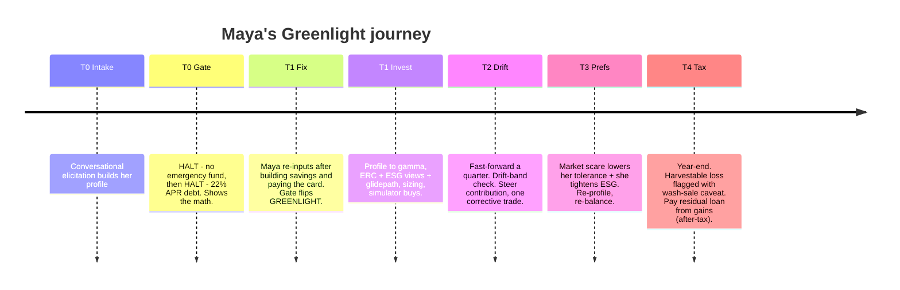
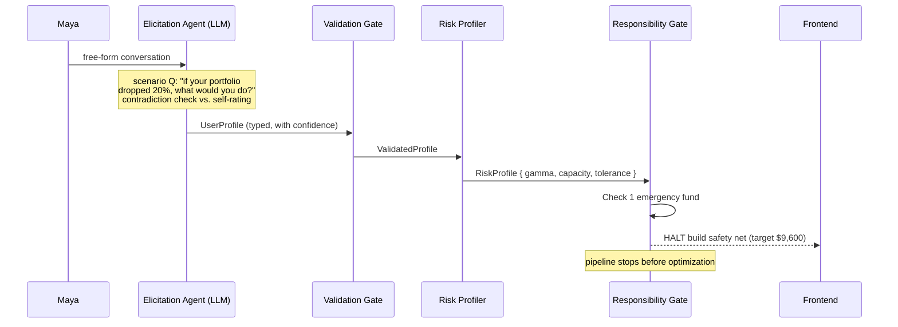
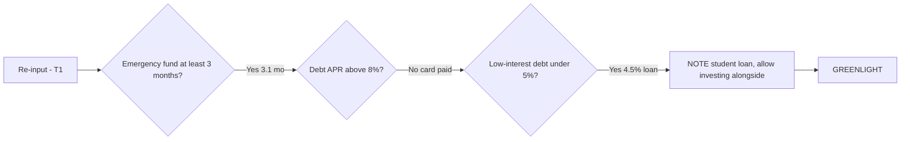
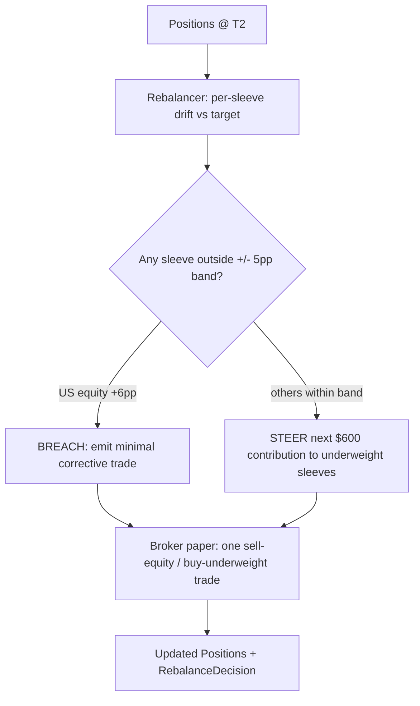
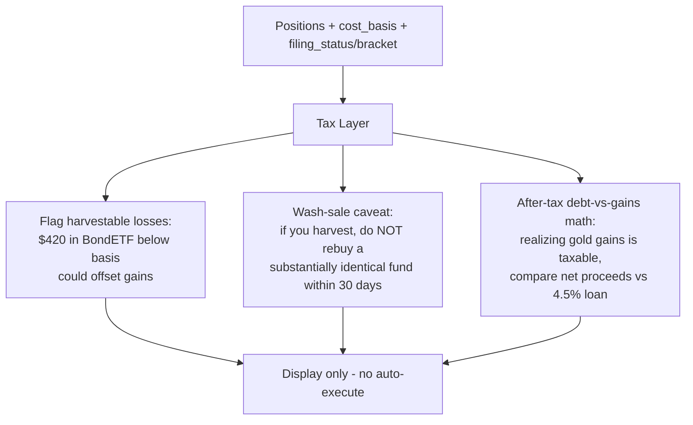

# Greenlight — Worked Use Case & Data-Flow

**Status:** Design v2 (post-review) · **Date:** 2026-05-30

This document traces a single persona, **Maya**, through the entire system across a multi-event timeline that exercises **every** category: the responsibility gate halting on debt + no safety net, the gate flipping to greenlight, allocation and execution, quarterly drift rebalancing, a mid-stream **preference change**, paying down debt **with capital gains**, and a year-end **wash-sale / tax-loss-harvesting** moment.

It complements [01-e2e-design.md](./01-e2e-design.md) (architecture) and [02-research-foundations.md](./02-research-foundations.md) (citations). Diagrams are Mermaid; the data objects shown are the abstract contracts from the E2E design.

---

## The persona

**Maya, 28.** Software-adjacent contractor (somewhat variable income → human capital leans *mixed*).

| Field | Value at intake (T0) |
|-------|----------------------|
| Household income | $78,000/yr |
| Monthly expenses | $3,200 |
| Capital on hand | $6,000 |
| Emergency fund | $1,500 (≈ 0.5 months) |
| Debt | $9,000 credit card @ **22% APR**; $14,000 student loan @ 4.5% |
| Age / horizon | 28 / ~37 years to retirement |
| Risk tolerance | Self-described "moderate-aggressive" |
| Preferences | Prefers ETFs; **ESG-conscious** (exclude fossil fuels, weapons) |
| Filing status | Single, 0 dependents |

Maya *wants* to start investing aggressively. Greenlight's job is to tell her the truth first.

---

## Timeline overview



---

## T0 — Intake and the gate halts

### Data flow



### What each component produces

- **Elicitation Agent → `UserProfile`.** Maya says she's "moderate-aggressive," but to the scenario question ("portfolio drops 20%") she answers "I'd probably sell to stop the bleeding." The agent **flags the contradiction**, asks a follow-up, and records `loss_aversion_probe` indicating higher loss aversion than her self-rating. `confidence.risk = 0.6`, `uncertainty_flags = [risk_tolerance]`.
- **Risk Profiler → `RiskProfile`.** Tolerance maps to a moderate γ, but with a wide band (low confidence). Capacity is *low*: emergency fund ≈ 0.5 months, high-APR debt, mixed human-capital beta.
- **Responsibility Gate → `GateResult`.**
  - **Check 1 (emergency fund):** $1,500 < 3 × $3,200 = $9,600. → **HALT.** Output: *"Build your safety net first — target $9,600 (3 months of expenses)."*
  - **Harm prevented (shown):** the screen also previews the 22% card: *"Investing behind this card would cost you ~$1,980/yr in interest while you chase an uncertain ~7% return. Paying it off is a guaranteed, tax-free 22%."*
  - The gate stops here; checks 2+ are shown as "next up" but optimization never runs.

### What Maya sees

A calm, non-judgmental screen: **"Not yet — and here's why."** The target dollar figure, the harm-prevented number, and a preview that her 22% card would *also* block investing. No portfolio is built. This is the benevolence moment.

**Framing (say it on stage):** the halt is **deferred conversion, not refusal.** Greenlight hasn't lost Maya — it's coaching her toward the day she's ready, and the gate-flip (T1) is the conversion event. A trust-first funnel, not a non-product.

---

## T1 — Maya fixes her situation; the gate flips

Maya spends a few months building savings and aggressively paying the card. She **re-inputs** her updated status (E2E §6 event trigger).

| Field | T0 | T1 |
|-------|----|----|
| Emergency fund | $1,500 | **$10,000** (≈ 3.1 months) |
| Credit card debt @ 22% | $9,000 | **$0** |
| Student loan @ 4.5% | $14,000 | $14,000 |
| Capital on hand | $6,000 | **$7,500** |
| Monthly surplus (`income/12 − expenses`) | ~$3,300 | ~$3,300 |
| Chosen monthly investment contribution | $0 (gate halted) | **$600** (rest → student loan + savings) |

### The gate re-runs



`GateResult { status: greenlight, notes: ["4.5% student loan below threshold — investing allowed alongside"] }`. The 4.5% loan is below the ~8% halt threshold *and* below ~5%, so it's noted but not blocking.

### Allocation pipeline runs

```mermaid
sequenceDiagram
    participant G as Gate (greenlight)
    participant Uni as Universe Builder
    participant Opt as Optimizer (ERC + BL + LW)
    participant Gl as Glide-Path Adjuster
    participant Sz as Affordability Sizer
    participant Br as Broker (in-process simulator)
    participant N as Explanation Agent

    G->>Uni: ValidatedProfile.preferences
    Note over Uni: ESG exclusions remove fossil/weapons<br/>sleeves = US eq, intl eq, bonds, TIPS, gold, REITs
    Uni->>Opt: Universe { tickers, sleeves }
    Note over Opt: ERC on Ledoit-Wolf covariance,<br/>scaled to target vol from gamma,<br/>ESG tilt as Black-Litterman view
    Opt->>Gl: TargetWeights + RiskMetrics
    Note over Gl: age 28, mixed human capital<br/>=> high equity tilt (lifecycle)
    Gl->>Sz: glide-adjusted TargetWeights
    Note over Sz: $7,500 capital + $600/mo surplus<br/>=> partial lump + DCA schedule, fractional shares
    Sz->>Br: OrderPlan { buys[], schedule }
    Br-->>N: Fills + Positions
    N-->>G: plain-language rationale + disclaimers
```

**Representative output (`TargetWeights`, illustrative):** US equity 38% · intl equity 20% · bonds 18% · TIPS 8% · gold 8% · REITs 8% — the ERC risky sleeve blended toward bonds along the capital-allocation line to hit her target volatility (her γ is a *band*, so the engine shows a vol *range* ≈ 11–15%; numbers illustrative), ESG-screened, age-tilted. The Sizer turns $7,500 into fractional-share buys plus a $600/mo DCA schedule. Orders go to the **in-process broker simulator** (Alpaca paper optional, same adapter); positions read back into the live portfolio view.

**The Monte Carlo beat (headline moment).** With the allocation and her $600/mo contributions, the Goal-Success Engine runs a **stationary block bootstrap** of historical sleeve returns over her 37-year horizon and reports an **illustrative** *"~82% chance of funding your retirement goal"* (exact number comes from the live bootstrap — not pinned), with a fan chart of outcome percentiles and a 5th-percentile "bad case." A toggle flips to a **Gaussian** simulation; for Maya's left-fat-tailed return mix it shows a higher number — and the narration calls out that *Gaussian understates left-tail risk (Pfau 2010), which is exactly why we don't headline it* (the honest comparison is on the bad-case/5th-percentile, not the headline %). This is the technical-depth-plus-pathos centerpiece of the post-greenlight view (`Projection { p_success, percentile_paths, bad_case }`).

---

## T2 — Fast-forward a quarter: drift-band rebalance

The demo's simulated clock advances one quarter; prices drift (equities up, bonds down).



- US equity drifted to +6pp → **band breach** → one minimal corrective trade.
- Bonds/TIPS slightly underweight but within band → **no trade**; the next $600 contribution is **steered** toward them (no fee, no taxable event).
- `RebalanceDecision { trade: [trim US equity → buy bonds/TIPS], steer: next_contribution }`.

This demonstrates the cost/tax-aware design: trade only on breach, otherwise steer contributions.

---

## T3 — Preferences change: re-profile and re-balance

A market scare rattles Maya. She revisits the agent: she now wants **lower risk** and a **stricter ESG** screen (also exclude tobacco). This is an **event trigger** — the pipeline re-runs from the gate forward.

```mermaid
sequenceDiagram
    participant U as Maya
    participant L as Elicitation Agent
    participant P as Risk Profiler
    participant Uni as Universe Builder
    participant Opt as Optimizer
    participant Rb as Rebalancer

    U->>L: "I want less risk; also exclude tobacco"
    L->>P: updated risk signals (higher loss aversion)
    Note over P: gamma increases (more risk-averse)<br/>=> lower target volatility
    P->>Uni: updated preferences (ESG += tobacco)
    Uni->>Opt: narrower Universe
    Note over Opt: ERC re-solved at lower target vol,<br/>BL ESG views strengthened
    Opt->>Rb: new TargetWeights
    Note over Rb: diff vs current Positions,<br/>minimal trades to reach new targets
    Rb-->>U: rebalance plan + narration
```

Higher γ → lower target volatility → the new `TargetWeights` shift toward bonds/TIPS/gold; tobacco names drop from the universe; the Rebalancer computes the **minimal trade set** to move from current positions to the new targets. The gate re-runs first and still greenlights (her finances are healthy), so it passes straight through.

---

## T4 — Year-end: tax-loss harvesting, wash sale, and paying debt with gains

Year-end. Some positions are below cost basis (a bond ETF), others have unrealized gains (gold, US equity). Maya also has the residual 4.5% student loan and wonders whether to pay a chunk with investment gains.

### Tax layer (read-only, advisory)



- **Harvestable loss flag:** "$420 of unrealized loss in your bond ETF. Selling it would offset capital gains (and up to $3,000 of ordinary income this year, with carryforward)." (Citations: research §8.)
- **Wash-sale caveat:** "If you harvest, don't repurchase a substantially identical fund within 30 days (before or after), or the loss is disallowed under IRC §1091." Greenlight suggests a *non-substantially-identical* replacement sleeve to stay invested without triggering the rule. **Nothing auto-executes.**
- **"Pay off debt with capital gains":** Maya considers selling appreciated gold to pay down the 4.5% loan. The Tax Layer shows the **after-tax** picture: realizing the gain is a taxable event, so the *net* proceeds (after capital-gains tax) are what actually retire debt. Because the loan is only 4.5% and gate-cleared, the system frames this as **optional** — it does *not* push her to realize a taxable gain to chase a low-interest payoff, and contrasts it with how the gate *would* have pushed payoff for the old 22% card. (This is the gate's economic logic applied symmetrically — research §4.)

### What Maya sees

A year-end summary: harvest opportunity with the wash-sale guardrail, the after-tax math on paying the loan from gains, and a clear "these are options, not auto-executed" framing — with the standing **not-advice** disclaimer (E2E §12).

---

## Component-by-stage data map

| Stage | Input object | Component | Output object |
|-------|-------------|-----------|---------------|
| T0 intake | dialogue | Elicitation Agent | `UserProfile` |
| T0 validate | `UserProfile` | Validation Gate | `ValidatedProfile` |
| T0 profile | `ValidatedProfile` | Risk Profiler | `RiskProfile` |
| T0 gate | `ValidatedProfile` + `RiskProfile` | Responsibility Gate | `GateResult{halt}` |
| T1 re-run | updated inputs | Responsibility Gate | `GateResult{greenlight}` |
| T1 universe | preferences | Universe Builder | `Universe` |
| T1 optimize | `RiskProfile` + `Universe` + prices | Optimizer | `TargetWeights` + `RiskMetrics` |
| T1 glide | `TargetWeights` + lifecycle | Glide-Path Adjuster | glide-adjusted `TargetWeights` |
| T1 size | weights + capital/surplus | Affordability Sizer | `OrderPlan` |
| T1 execute | `OrderPlan` | Broker Adapter | `Fills` + `Positions` |
| T2 rebalance | `Positions` + `TargetWeights` | Rebalancer | `RebalanceDecision` |
| T3 re-profile | updated signals/prefs | Profiler → Optimizer → Rebalancer | new `TargetWeights` + `RebalanceDecision` |
| T4 tax | `Positions` + basis + bracket | Tax Layer | `TaxReport` |
| all | any engine output | Explanation Agent | narration + disclaimers |

---

## Why this use case wins on stage

1. **The halt is the hook.** Opening with "Not yet — here's why" (T0), with the harm-prevented dollar figure, is memorable and unique among robo-advisor demos.
2. **The flip is the payoff.** Watching the gate turn green after Maya fixes her finances (T1) is the conversion moment — the signature red→green animation.
3. **Two technical showpieces, shown not described:** the Monte Carlo success-probability fan chart (T1) and the pre-computed out-of-sample backtest beating 60/40 with a visible Deflated Sharpe.
4. **The transparent parameter panel** shows judges the LLM-elicits/engine-decides boundary — the rigor and trust story in one view, including the contradiction-catch.

**Focus discipline (important).** This document traces *all* events end-to-end so the team understands the full system — but the **live 3-minute demo is only T0 → T1** (halt → fix → flip → allocation → Monte Carlo → backtest). T2 (drift rebalance), T3 (preference change), and T4 (tax/wash-sale) are shown **fast, as a single "…and it maintains the portfolio, rebalances tax-efficiently, and flags harvestable losses" line with one screenshot**, with depth available on judge request. Trying to exercise every category live in three minutes exercises none of them well. The full pitch + timed demo script is in **[04-build-and-demo.md](./04-build-and-demo.md)**.
