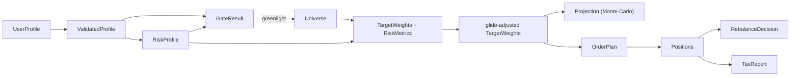

# Greenlight — Data Contracts, API & Worked Examples

**Status:** Design v2 (post-review) · **Date:** 2026-05-30 · **Audience:** implementing agents

This is the precision layer for implementation. Where [01-e2e-design.md](./01-e2e-design.md) says *what* and *why*, this says *exactly what shape*. Every object, endpoint, formula, and fixture an agent needs is pinned here. Notation is language-agnostic pseudo-schema; map to Pydantic (engine) and TypeScript (frontend) 1:1.

**Design refinement flagged here (new):** the **risky/safe sleeve split** that makes the capital-allocation-line blend (01 §3.6) actually work. See §4.

## UI-Contract (frontend integration -- single source of truth)

Base path for the live frontend is `/api/v1`. The frontend consumes these shapes verbatim. In `gate_result.math.emergency_fund`, the emergency-fund target field is **`target_balance`**, not `target_amount`.

### Shared objects

```json
UserProfileInput = {
  "household_income": "number",
  "monthly_expenses": "number",
  "capital_on_hand": "number",
  "emergency_fund": "number",
  "debts": [{ "balance": "number", "apr": "number", "kind": "credit_card|student|mortgage|auto|personal|other" }],
  "age": "number",
  "horizon_years": "number",
  "goals": ["string"],
  "goal_target": "number",
  "dependents": "number",
  "filing_status": "single|married_joint|married_separate|head_of_household",
  "risk_instrument_responses": ["number"],
  "dohmen_risk": "number|null",
  "loss_scenario_response": "sell_all|sell_some|hold|buy_more",
  "loss_aversion_probe": "number|null",
  "income_stability": "bond_like|mixed|stock_like",
  "universe_pref": "etf|stock|mix",
  "esg_exclusions": ["fossil_fuels|weapons|tobacco|gambling|none"],
  "sector_theme_tilts": ["string"],
  "confidence": { "field": "number" },
  "uncertainty_flags": ["string"]
}

TargetWeights = {
  "by_ticker": { "TICKER": "number" },
  "by_sleeve": { "us_equity|intl_equity|bonds|tips|gold|reits": "number" },
  "blend_alpha": "number",
  "method": "erc|black_litterman|cvar"
}

Positions = {
  "items": [{ "ticker": "string", "shares": "number", "avg_cost": "number", "market_value": "number" }],
  "portfolio_value": "number",
  "cash": "number"
}

PortfolioResponse = {
  "universe": {
    "tickers": ["string"],
    "sleeves": { "us_equity|intl_equity|bonds|tips|gold|reits": ["string"] },
    "risky_sleeves": ["us_equity|intl_equity|bonds|tips|gold|reits"],
    "safe_sleeves": ["us_equity|intl_equity|bonds|tips|gold|reits"],
    "market_weights": { "us_equity|intl_equity|bonds|tips|gold|reits": "number" },
    "excluded": [{ "ticker": "string", "reason": "string" }]
  },
  "weights": TargetWeights,
  "metrics": {
    "expected_vol": "number",
    "expected_shortfall_95": "number",
    "risk_contributions": { "us_equity|intl_equity|bonds|tips|gold|reits": "number" }
  }
}
```

### POST `/onboard` -> `OnboardResponse`

Request body is `UserProfileInput`. Optional query: `user_email`.

```json
{
  "status": "greenlight|halt|needs_clarification|no_profile",
  "validated_profile": "ValidatedProfile|null",
  "risk_profile": "RiskProfile|null",
  "gate_result": {
    "status": "greenlight|halt",
    "failed_check": "emergency_fund|high_interest_debt|none|null",
    "reason": "string|null",
    "recommended_action": "string",
    "math": {
      "check": "emergency_fund|high_interest_debt",
      "emergency_fund": {
        "current_balance": "number",
        "monthly_expenses": "number",
        "months_covered": "number",
        "required_months": "number",
        "target_balance": "number",
        "shortfall": "number"
      },
      "debt": {
        "debt_balance": "number",
        "apr": "number",
        "debt_kind": "string",
        "guaranteed_return": "number",
        "expected_after_tax_market_return": "number",
        "interest_accruing_annual": "number",
        "net_advantage_annual": "number",
        "verdict": "string"
      }
    },
    "notes": ["string"],
    "preview_next_checks": ["string"],
    "checks": [
      { "key": "emergency_fund", "status": "pass|fail|warn", "detail": "string" },
      { "key": "high_interest_debt", "status": "pass|fail|warn", "detail": "string" }
    ]
  },
  "financial_analysis": "FinancialAnalysis|null",
  "optimizer_input": "OptimizerInput|null",
  "portfolio": "PortfolioResponse|null",
  "clarification_requests": [{ "field": "string", "issue": "string", "suggested_question": "string" }]
}
```

`gate_result.math` is `null` when `status` is `greenlight`. On an emergency-fund halt, `math.emergency_fund` is populated and `math.debt` is `null`; on a high-interest-debt halt, `math.debt` is populated and `math.emergency_fund` is `null`.

### Finance endpoints

`POST /portfolio`

```json
Request = { "profile": UserProfileInput }
Response = PortfolioResponse
```

#### Backtest

`POST /backtest`

```json
Request = {
  "profile": "UserProfileInput|null",
  "weights": "TargetWeights|null",
  "start": "YYYY-MM-DD|null",
  "end": "YYYY-MM-DD|null"
}

Response = {
  "equity_curve": [{ "date": "YYYY-MM-DD", "value": "number" }],
  "metrics": {
    "sharpe": "number",
    "sortino": "number",
    "max_drawdown": "number",
    "calmar": "number",
    "turnover": "number"
  },
  "benchmarks": {
    "one_over_n": {
      "equity_curve": [{ "date": "YYYY-MM-DD", "value": "number" }],
      "metrics": { "sharpe": "number", "sortino": "number", "max_drawdown": "number", "calmar": "number", "turnover": "number" }
    },
    "sixty_forty": {
      "equity_curve": [{ "date": "YYYY-MM-DD", "value": "number" }],
      "metrics": { "sharpe": "number", "sortino": "number", "max_drawdown": "number", "calmar": "number", "turnover": "number" }
    },
    "target_date": {
      "equity_curve": [{ "date": "YYYY-MM-DD", "value": "number" }],
      "metrics": { "sharpe": "number", "sortino": "number", "max_drawdown": "number", "calmar": "number", "turnover": "number" }
    }
  }
}
```

Exactly one of `profile` or `weights` is required. The MVP backend may serve a precomputed/cached walk-forward JSON artifact.

`POST /projection`

```json
Request = {
  "weights": TargetWeights,
  "horizon_years": "number",
  "monthly_contribution": "number",
  "capital_on_hand": "number",
  "goal_target": "number",
  "generator": "stationary_bootstrap|gaussian",
  "seed": "number|null",
  "n_paths": "number"
}

Response = {
  "p_success": "number",
  "generator": "stationary_bootstrap|gaussian",
  "horizon_years": "number",
  "percentile_paths": { "p5": ["number"], "p25": ["number"], "p50": ["number"], "p75": ["number"], "p95": ["number"] },
  "bad_case_terminal": "number",
  "median_terminal": "number",
  "n_paths": "number"
}
```

`POST /rebalance`

```json
Request = { "positions": Positions, "weights": TargetWeights }
Response = {
  "action": "none|steer|trade",
  "drifts": { "us_equity|intl_equity|bonds|tips|gold|reits": { "current": "number", "target": "number", "drift_pp": "number" } },
  "steer": { "next_contribution_to": ["us_equity|intl_equity|bonds|tips|gold|reits"] },
  "trades": [{ "ticker": "string", "side": "buy|sell", "shares": "number" }]
}
```

`steer` may be `null`; `trades` is an empty array unless action is `trade`.

`POST /tax/report`

```json
Request = {
  "positions": Positions,
  "cost_basis": { "TICKER": "number" },
  "filing_status": "single|married_joint|married_separate|head_of_household",
  "bracket": "number|null"
}

Response = {
  "harvestable": [{ "ticker": "string", "unrealized_loss": "number", "note": "string" }],
  "wash_sale_warnings": [{ "ticker": "string", "window_days": "number", "suggested_replacement": "string" }],
  "after_tax_notes": ["string"]
}
```

### User/profile endpoints

`GET /profile/{email}` returns `OnboardResponse`. If no profile exists, response is `{ "status": "no_profile", "validated_profile": null, "risk_profile": null, "gate_result": null, "financial_analysis": null, "optimizer_input": null, "portfolio": null, "clarification_requests": [] }`.

`GET /users/{email}/record`

```json
{
  "account": { "email": "string", "name": "string", "created_at": "string|null" },
  "profile_input": "UserProfileInput|null",
  "onboard_result": "OnboardResponse|null",
  "chat_sessions": [
    {
      "id": "string",
      "kind": "elicitation|advisor",
      "status": "string",
      "created_at": "string|null",
      "updated_at": "string|null",
      "extracted_profile": "object|null",
      "messages": [{ "role": "user|assistant", "content": "string", "seq": "number", "created_at": "string|null" }]
    }
  ]
}
```

`GET /users/{email}/chats` returns the same `chat_sessions[]` item shape with `messages: []`. Optional query: `kind=elicitation|advisor`.

`GET /config`

```json
{
  "gate": {
    "emergency_fund_months_required": "number",
    "high_apr_threshold": "number",
    "low_apr_threshold": "number"
  },
  "market_assumptions": {
    "expected_market_return": "number",
    "ltcg_rate": "number",
    "expected_after_tax_market_return": "number"
  }
}
```

### SSE event protocol

Both chat endpoints use `Content-Type: text/event-stream`. Each event frame is `data: <json-or-[DONE]>\n\n`.

`POST /chat` request:

```json
{
  "messages": [{ "role": "user|assistant", "content": "string" }],
  "user_email": "string|null",
  "session_id": "string|null"
}
```

`POST /chat` events:

```json
{ "type": "session", "session_id": "string" }
{ "type": "token", "content": "string" }
{ "type": "profile_ready", "profile": UserProfileInput }
{ "type": "error", "content": "string" }
[DONE]
```

`POST /advisor/chat` request:

```json
{
  "messages": [{ "role": "user|assistant", "content": "string" }],
  "user_email": "string|null",
  "session_id": "string|null",
  "context": "OnboardResponse|null"
}
```

`POST /advisor/chat` events:

```json
{ "type": "session", "session_id": "string" }
{ "type": "token", "content": "string" }
{ "type": "error", "content": "string" }
[DONE]
```

### Frontend client SDK to implement

Backend team does not edit frontend for this backend-only module. Frontend team must add these wrappers to `client/src/api/greenlightClient.js`, using the existing host-relative `BASE` and fetch/error pattern:

```js
postPortfolio(profile)   // POST `${BASE}/api/v1/portfolio` with body { profile }
postBacktest(input)      // POST `${BASE}/api/v1/backtest` with body { profile | weights, start?, end? }
postProjection(input)    // POST `${BASE}/api/v1/projection` with body input
postRebalance(input)     // POST `${BASE}/api/v1/rebalance` with body input
postTaxReport(input)     // POST `${BASE}/api/v1/tax/report` with body input
```

Frontend team must add `BacktestPanel.jsx` with a curve overlay for the strategy and benchmarks plus a metrics comparison table. Backend-only Module F does not implement that panel.

---

## 1. Conventions

- `money` = decimal, USD, ≥ 0 unless noted. `percent` = decimal fraction (0.22 = 22%), not "22".
- `weight` = decimal in [0, 1]; a weight vector sums to 1.0 ± 1e-6.
- All enums list their **complete** member set. Unknown enum value → validation error.
- Timestamps ISO-8601. IDs are UUIDv4 strings.
- Every API error uses the shape in §6.4.

---

## 2. Object schemas

### 2.1 `UserProfile` (LLM output → engine input)
```
UserProfile {
  household_income:    money            # annual gross
  monthly_expenses:    money            # essential monthly
  capital_on_hand:     money            # investable now
  emergency_fund:      money            # liquid reserves
  debts: [ Debt ]                       # may be empty
  age:                 int   [18..100]
  horizon_years:       int   [1..60]
  goals:               [ enum(retirement|home|education|general_wealth) ]   # >=1
  goal_target:         money            # target terminal wealth; 0 if none
  dependents:          int   [0..20]
  filing_status:       enum(single|married_joint|married_separate|head_of_household)
  risk_instrument_responses: [ int ]    # Grable-Lytton item scores, len 13
  dohmen_risk:               int|null   # Dohmen single-item willingness, 0..10
  loss_scenario_response:    enum(buy_more|hold|sell_some|sell_all)
  loss_aversion_probe:       number     # smallest $win to accept 50/50 lose-$100; >=0
  income_stability:    enum(bond_like|mixed|stock_like)
  universe_pref:       enum(etf|stock|mix)
  esg_exclusions:      [ enum(fossil_fuels|weapons|tobacco|gambling|none) ]
  sector_theme_tilts:  [ string ]       # free tags; may be empty
  confidence:          map<string, number[0..1]>   # per top-level field
  uncertainty_flags:   [ string ]                  # field names needing follow-up
}

Debt {
  balance: money            # > 0
  apr:     percent          # e.g. 0.22
  kind:    enum(credit_card|student|auto|mortgage|personal|other)
}
```

### 2.2 `ValidatedProfile`
Same fields as `UserProfile` minus `confidence`/`uncertainty_flags`, **after** validation (§6 rules). Adds `derived: { required_emergency_fund: money, monthly_surplus: money }` where `monthly_surplus = household_income/12 − monthly_expenses` (may be negative).

### 2.3 `RiskProfile` and `GammaBand`
```
GammaBand {                              # keyed by RISK POSTURE, not numeric size
  aggressive:   number                   # the SMALLEST gamma (lower gamma = more risk)
  mid:          number
  conservative: number                   # the LARGEST gamma
}                                        # invariant: aggressive <= mid <= conservative, each in [1.5, 8.0]

RiskProfile {
  gamma_band:        GammaBand           # combined (capacity-capped) gamma
  tolerance_gamma:   GammaBand
  capacity_gamma:    number              # implied floor (a single gamma); caps the aggressive side
  capacity_score:    number [0..100]
  tolerance_score:   number [0..100]
  binding_axis:      enum(tolerance|capacity)
  target_vol_band:   { aggressive: percent, mid: percent, conservative: percent }
                                         # target_vol.aggressive = SR_ref / gamma_band.aggressive  (HIGHEST vol)
                                         # both bands keyed by posture, so aggressive<->aggressive — no index crossing
  signal_confidence: number [0..1]       # confidence after GL-13/Dohmen/loss-aversion fusion
  contradiction_note?: string            # present when fusion had material cross-signal tension
  loss_aversion_flag: boolean            # true when the real loss-aversion signal is elevated
}
```
**Why posture-keyed, not `low/high`:** gamma is inverted relative to risk (low gamma = aggressive = high vol). Naming the band `low/high` invites `target_vol.low = SR_ref/gamma.low`, which silently inverts the dial. Keying both bands by posture removes the trap.

**UI contract for fused risk output:** `gamma_band` is the final capacity-capped
band the UI should display. `tolerance_gamma` is now the fused tolerance band from
the independent GL-13, Dohmen, and optional loss-aversion γ signals; `capacity_gamma`
is still applied element-wise with `max(tolerance_gamma, capacity_gamma)`.
`binding_axis` identifies whether the mid γ is set by tolerance or capacity.
`signal_confidence` lets RiskView show how coherent the underlying instruments
were. If fusion determines the signals disagree enough to require follow-up, the
risk-profile endpoint returns `needs_clarification` instead of a `RiskProfile`; any
`contradiction_note` that appears on a returned profile is advisory context only.

### 2.4 `GateResult`
```
GateResult {
  status:             enum(greenlight|halt)
  failed_check:       enum(emergency_fund|high_interest_debt|none)
  reason:             string             # human-readable
  recommended_action: string            # "" if greenlight
  math: {                                # populated on halt
    target_amount:        money          # emergency-fund target, if that check
    debt:                 Debt | null
    guaranteed_return:    percent        # = debt.apr
    expected_after_tax_market_return: percent
    interest_accruing_annual: money      # = balance * apr (gross interest; the punchy headline number)
    net_advantage_annual:     money      # = balance * (apr - expected_after_tax_market_return); the TRUE harm prevented vs investing
  } | null
  notes: [ string ]                      # e.g. low-interest debt noted
}
```

### 2.5 `Universe`
```
Universe {
  tickers:        [ string ]
  sleeves:        map<sleeve, [ticker]>          # sleeve enum below
  risky_sleeves:  [ sleeve ]                      # see §4
  safe_sleeves:   [ sleeve ]
  market_weights: map<sleeve, weight>             # BL equilibrium prior; sums to 1
  excluded:       [ { ticker, reason } ]
}
sleeve = enum(us_equity|intl_equity|bonds|tips|gold|reits)
```

### 2.6 `TargetWeights` + `RiskMetrics`
```
TargetWeights {
  by_ticker:  map<ticker, weight>     # sums to 1
  by_sleeve:  map<sleeve, weight>     # sums to 1
  blend_alpha: weight                 # a in [0,1]: risky-sleeve fraction (§4)
  method:     enum(erc|black_litterman|cvar)   # which variant produced this
}
RiskMetrics {
  expected_vol:        percent
  expected_shortfall_95: percent      # CVaR at 95%
  risk_contributions:  map<sleeve, percent>     # sums to 100% for ERC ~ equal
}
```

### 2.7 `Projection` (Monte Carlo)
```
Projection {
  p_success:        percent                 # P(terminal wealth >= goal_target)
  generator:        enum(stationary_bootstrap|gaussian)
  horizon_years:    int
  percentile_paths: map<enum(p5|p25|p50|p75|p95), [ money ]>   # wealth by year
  bad_case_terminal: money                  # p5 terminal wealth
  median_terminal:   money
  n_paths:          int                     # e.g. 10000
}
```

### 2.8 `OrderPlan`, `Fills`, `Positions`
```
OrderPlan {
  method:   enum(lump_sum|dca)
  buys:     [ { ticker, dollars: money, shares: number } ]   # fractional shares ok
  schedule: [ { month_offset: int, contribution: money } ]   # dca only
}
Fill     { ticker, shares: number, price: money, ts }
Position { ticker, shares: number, avg_cost: money, market_value: money }
Positions { items: [Position], portfolio_value: money, cash: money }
```

### 2.9 `RebalanceDecision`
```
RebalanceDecision {
  action:  enum(none|steer|trade)
  drifts:  map<sleeve, { current: weight, target: weight, drift_pp: number }>
  steer:   { next_contribution_to: [sleeve] } | null
  trades:  [ { ticker, side: enum(buy|sell), shares: number } ]   # empty unless trade
}
```

### 2.10 `TaxReport`
```
TaxReport {
  harvestable: [ { ticker, unrealized_loss: money, note: string } ]
  wash_sale_warnings: [ { ticker, window_days: int=30, suggested_replacement: ticker } ]
  after_tax_notes: [ string ]
}
```

### 2.11 `BacktestResult` (pre-computed, static)
```
BacktestResult {
  strategies: map<enum(greenlight_erc|one_over_n|sixty_forty|target_date|naive_mvo),
                  { equity_curve: [{date, value:money}],
                    drawdown_curve: [{date, dd:percent}],
                    metrics: { cagr, sharpe, deflated_sharpe, sortino, max_drawdown, calmar, turnover } }>
  config: { window_months:int, rebalance:enum(monthly|quarterly), tx_cost_bps:number, n_trials:int, period:{start,end} }
}
```

---

## 3. Component dependency graph (what feeds what)



---

## 4. The risky/safe split & CAL-blend (design refinement)

**Problem.** ERC over all six sleeves yields an inherently moderate volatility (~8–11%). You cannot reach an aggressive investor's higher target vol by *de-risking* alone (we are long-only, no leverage). So a single ERC-over-everything portfolio cannot span aggressive→conservative.

**Resolution.** Two-fund construction:
- **Risky portfolio** `P_risky` = **ERC over `risky_sleeves` = {us_equity, intl_equity, reits, gold}**. Higher vol (~14–16%).
- **Safe portfolio** `P_safe` = market-weighted `safe_sleeves` = {bonds, tips} (or a cash proxy). Lower vol (~4–6%).
- **Final weights** = `a · w_risky + (1 − a) · w_safe`, where `a ∈ [0, 1]` is the single dial that carries **both** the risk budget and the glide path.

**Choosing `a`** to hit `σ_target` (from γ, §7.2):
```
σ_blend(a) = sqrt( a²·σ_risky² + (1−a)²·σ_safe² + 2·a·(1−a)·ρ·σ_risky·σ_safe )
a* = the a in [0,1] solving σ_blend(a) = σ_target   (bisection)
if σ_target >= σ_risky:  a* = 1   (clamp — cannot exceed all-risky long-only)
if σ_target <= σ_safe:   a* = 0
```
`σ_risky`, `σ_safe`, `ρ` come from the (shrunk) covariance of the realized sleeve portfolios.

**Expected saturation (by design, not a bug).** Long-only with no leverage means the most aggressive reachable portfolio *is* the all-risky ERC sleeve (`a=1`, vol = `σ_risky` ≈ 0.16). Any `σ_target > σ_risky` clamps to `a=1`. With `SR_ref=0.4`, every `γ < SR_ref/σ_risky = 0.4/0.16 = 2.5` maps to the same all-risky portfolio. This is correct (you cannot be more aggressive than 100% growth assets without leverage) — but it means the dial is only *responsive* over roughly `γ ∈ [2.5, 8.0]` → `σ_target ∈ [0.05, 0.16]`. If you want responsiveness at more aggressive γ, either concentrate the risky sleeve (drop gold/REIT weight to raise `σ_risky`) or lower `SR_ref`. Document whichever you pick; do not silently present a smooth dial that secretly saturates.

**Glide path** then nudges `a` down with age (linear MVP): `a_final = a* · glide_factor(age, horizon)`, `glide_factor ∈ [0,1]`, e.g. `glide_factor = clamp(1 − max(0, age−25)/100, 0.3, 1.0)`. (The U-shaped bond-tent is a future replacement for `glide_factor`; the Monte Carlo layer is what would justify it.)

BL and CVaR variants replace the *risky-sleeve* construction only (the blend mechanic is unchanged).

---

## 5. Universe reference table (committed starter set)

| sleeve | ticker | role | esg_tags | market_weight (prior) |
|--------|--------|------|----------|----------------------|
| us_equity | VTI | risky | broad | 0.45 |
| intl_equity | VEA | risky | broad | 0.20 |
| reits | VNQ | risky | broad | 0.05 |
| gold | GLD | risky | broad | 0.05 |
| bonds | BND | safe | broad | 0.20 |
| tips | TIP | safe | broad | 0.05 |

ESG exclusions map to substitute tickers (e.g. `fossil_fuels` → swap VTI→ESGV, VEA→ESGD; `none` = no change). Substitution table lives in `engine/data/universe.csv`. `market_weights` are the BL equilibrium prior and must sum to 1.0.

---

## 6. API contract (FastAPI; JSON over HTTP)

Base path `/api`. All POST bodies and responses are JSON matching §2. Frontend mocks these with static fixtures (§8) until the engine is wired.

### 6.1 Pipeline endpoints
| Method | Path | Body → Response |
|--------|------|-----------------|
| POST | `/profile/extract` | `{ turns: [...] }` or `{ form: {...} }` → `UserProfile` |
| POST | `/profile/validate` | `UserProfile` → `ValidatedProfile` \| `{ clarification_requests: [...] }` |
| POST | `/risk/profile` | `ValidatedProfile` → `RiskProfile` |
| POST | `/gate/evaluate` | `{ profile: ValidatedProfile, risk: RiskProfile }` → `GateResult` |
| POST | `/portfolio/build` | `{ profile, risk }` → `{ universe: Universe, weights: TargetWeights, metrics: RiskMetrics }` |
| POST | `/projection/montecarlo` | `{ weights, horizon_years, monthly_contribution, capital_on_hand, goal_target, generator }` → `Projection` |
| POST | `/sizing` | `{ weights, capital_on_hand, monthly_surplus }` → `OrderPlan` |
| POST | `/execute` | `OrderPlan` → `{ fills: [Fill], positions: Positions }` |
| GET | `/positions` | → `Positions` |
| POST | `/rebalance` | `{ positions: Positions, weights: TargetWeights }` → `RebalanceDecision` |
| POST | `/tax/report` | `{ positions, cost_basis: map<ticker,money>, filing_status, bracket: percent }` → `TaxReport` |
| GET | `/backtest` | → `BacktestResult` (static) |
| POST | `/narrate` | `{ kind: string, payload: object }` → `{ text: string }` |

### 6.2 Orchestration (demo convenience)
| POST | `/run` | `ValidatedProfile` → `{ gate: GateResult, weights?, metrics?, projection?, order_plan? }` (stops at gate if halt) |

### 6.3 Demo controls
| POST | `/sim/fast-forward` | `{ quarters: int }` → drifts simulator prices, returns new `Positions` |

### 6.4 Error shape
```
{ error: { code: enum(validation|not_found|engine|upstream), message: string, field?: string } }
```
HTTP 422 for `validation`, 404 `not_found`, 500 `engine`, 502 `upstream`.

---

## 7. Worked numeric examples (these pin behavior — implement to match)

### 7.1 Gate math (persona: Maya at T0)
Inputs: `monthly_expenses=3200`, `emergency_fund=1500`, debt `{balance:9000, apr:0.22}`, `bracket=0.22`, `expected_market_return=0.07`.
- **Emergency check:** `required = 3 × 3200 = 9600`. `1500 < 9600` → **HALT**, `failed_check=emergency_fund`, `target_amount=9600`, shortfall `8100`.
- **Debt check (shown as next-up):** `0.22 > 0.08` → would halt. `guaranteed_return = 0.22`. `expected_after_tax_market_return = 0.07 × (1 − 0.15) = 0.0595` (15% LTCG). `interest_accruing_annual = balance × apr = 9000 × 0.22 = 1980` (the punchy headline number). `net_advantage_annual = balance × (apr − 0.0595) = 9000 × 0.1605 = 1444.5` — this is the **true harm prevented** by choosing paydown over investing (the headline $1,980 is gross interest; don't conflate the two on stage).
- First failing check wins; the gate returns the emergency-fund halt.

### 7.2 γ calibration (persona: Maya at T1, greenlit)
Inputs: Grable-Lytton raw `score = 30`; constants mean `28.27`, SD `4.94`, α `0.77`, range `[1.5, 8.0]`, `SR_ref = 0.4`.
- `z = (30 − 28.27)/4.94 = 0.350` → `p = Φ(0.350) = 0.637`.
- `ln γ_mid = ln 8.0 − 0.637·(ln 8.0 − ln 1.5) = 2.079 − 0.637·1.674 = 1.013` → **`γ_mid = 2.75`**.
- `SEM = 4.94·√(1−0.77) = 2.37`. `score+SEM=32.37 → p=0.797 → γ=2.11` (this is the **aggressive** bound — higher score, lower γ); `score−SEM=27.63 → p=0.448 → γ=3.78` (**conservative** bound). **`gamma_band = {aggressive:2.11, mid:2.75, conservative:3.78}`** (aggressive ≤ mid ≤ conservative numerically, 2.11 ≤ 2.75 ≤ 3.78).
- **Capacity:** Maya's `capacity_score ≈ 73 → capacity_gamma = 2.36` (full derivation in 02 §3.1). Combine elementwise `gamma_band = max(tolerance_gamma, capacity_gamma)`: aggressive `max(2.11,2.36)=2.36`, mid `max(2.75,2.36)=2.75`, conservative `max(3.78,2.36)=3.78` → **combined `gamma_band = {aggressive:2.36, mid:2.75, conservative:3.78}`**. The **mid is set by tolerance** (2.75 > 2.36) → `binding_axis = tolerance`; capacity only caps the aggressive end (2.11→2.36). *(If her horizon were 1 yr, capacity_gamma≈6.0 would cap every element: mid=max(2.75,6.0)=6.0, binding_axis=capacity.)*
- **Target vol** (from the combined band): `target_vol_band = {aggressive: 0.4/2.36=0.169, mid: 0.4/2.75=0.145, conservative: 0.4/3.78=0.106}` — posture-keyed, so `aggressive` is the highest vol. `aggressive=0.169 > σ_risky≈0.16` ⇒ it **clamps to a=1** (the saturation in §4); the responsive part of Maya's band is mid→conservative.

### 7.3 CAL-blend (continuing 7.2)
Given `σ_risky=0.16`, `σ_safe=0.05`, `ρ=0.15`, `σ_target=0.145`:
- Solve `σ_blend(a)=0.145` by bisection → **`a* ≈ 0.90`** (verify: `σ_blend(0.88)=0.142`, `σ_blend(0.901)=0.145`). Since `0.145 < σ_risky=0.16`, no clamp.
- Glide: `age=28` → `glide_factor = clamp(1 − 3/100, 0.3, 1.0)=0.97` → **`a_final = 0.90·0.97 ≈ 0.87`**.
- **Final weights** = `a_final·w_risky + (1 − a_final)·w_safe` = `0.87·w_risky + 0.13·w_safe`. The glide-freed mass `(a* − a_final)` goes to the **safe** sleeve, so the vector still sums to 1.0. *(The illustrative donut in 03 T1 uses round numbers; exact weights come from the live ERC solve.)*

### 7.4 Monte Carlo (stationary block bootstrap)
1. Portfolio monthly return series `r_p = w_final · R` (R = historical sleeve returns matrix).
2. Block length `L` via Politis-White (default `L=12` if unavailable). Generate `n_paths=10000` paths of length `horizon_years×12`: repeatedly pick a random start index and a geometric(L)-length block; concatenate until path length reached.
3. Wealth sim per path: `W=capital_on_hand`; each month `W = W·(1+r) + monthly_contribution`.
4. `p_success = mean(W_terminal ≥ goal_target)`; percentile paths from the cross-path wealth distribution per year; `bad_case_terminal = 5th percentile`.
- **Gaussian toggle:** draw `r ~ Normal(mean(r_p), var(r_p))` i.i.d. — ignores fat tails. For the **typical case** (negatively-skewed / left-fat-tailed equity returns, goal not in the far right tail) it reports a **higher (optimistic)** `p_success` — the contrast we surface. **Caveat (not universal):** for right-skewed series or a goal sitting in the right tail, fat tails can *help* success and the ordering can flip. So the honest claim is "Gaussian understates left-tail risk," demonstrated by comparing the **5th-percentile / bad-case terminal wealth** (always worse under bootstrap for left-fat-tailed series), not by asserting `p_success_gaussian ≥ p_success_bootstrap` unconditionally.

### 7.5 Deflated Sharpe (backtest)
`DSR = Φ( (SR̂ − SR0) · √(T−1) / √(1 − γ3·SR0 + ((γ4−1)/4)·SR0²) )`
where γ3 = skew, γ4 = kurtosis of the strategy returns. **Note: the variance term uses `SR0`, not `SR̂`** (this was the bug in v1 — verified against Bailey & López de Prado 2014). `SR0` is the expected maximum Sharpe under the null given **N trials**:
`SR0 = √Var[SR̂across trials] · [ (1−ζ)·Φ⁻¹(1 − 1/N) + ζ·Φ⁻¹(1 − 1/(N·e)) ]`, with `ζ = 0.5772` (Euler-Mascheroni). **`config.n_trials` MUST equal the real count of configurations tried** (optimizer variants × rebalance freqs × windows). Report `DSR`, not just `SR̂`.

---

## 8. Fixtures & pre-baked artifacts (concrete deliverables)

| Artifact | Path | Shape |
|----------|------|-------|
| Cached prices | `engine/data/prices.csv` | `date, ticker, adj_close` (daily, full backtest window) |
| Universe + ESG subs | `engine/data/universe.csv` | per §5 + substitution columns |
| Halt persona | `engine/fixtures/persona_halt.json` | a `UserProfile` (Maya T0) |
| Greenlight persona | `engine/fixtures/persona_greenlight.json` | a `UserProfile` (Maya T1) |
| BL/CVaR toggle weights | `engine/fixtures/toggle_weights.json` | `{ black_litterman: TargetWeights, cvar: TargetWeights }` |
| Backtest result | `engine/data/backtest.json` | `BacktestResult` (§2.11) |
| Cached LLM responses | `engine/fixtures/llm_*.json` | per-persona extraction + narration, for offline demo |
| Seeded state | `engine/fixtures/state_seed.json` | positions/cost-basis for T2–T4 |

---

## 9. Repo / module layout

```
/engine                     # Python
  /schemas                  # Pydantic models = §2 contracts (source of truth)
  /profiler  /gate  /universe  /optimizer  /montecarlo
  /sizing  /rebalance  /tax  /backtest        # backtest = offline script + output
  /broker                   # adapter: simulator (primary) + alpaca (optional)
  /api                      # FastAPI (§6)
  /data  /fixtures          # §8
/frontend                   # React + shadcn
  /screens                  # intake, gate-result, portfolio, (rebalance/tax)
  /components  /lib         # api client + TS types mirrored from /engine/schemas
  /fixtures                 # mocked JSON matching §6
/docs/greenlight            # 00–06
```

**Source-of-truth rule:** `/engine/schemas` defines the contracts; the frontend TS types mirror them. If they disagree, the schema wins. Acceptance criteria per component live in the implementation plan ([06-implementation-plan.md](./06-implementation-plan.md)).

---

## 10. Canonical constants (single source of truth)

Every magic number lives here and in `engine/schemas/constants.py`. **No other doc or file may redefine these — they reference this table.** (Other docs previously scattered these across 01 §5, 02 §2.1, etc.; those are now illustrative only.)

| Constant | Value | Used by |
|----------|-------|---------|
| `EF_MONTHS` | 3 | gate emergency-fund check |
| `HIGH_APR` | 0.08 | gate debt halt threshold (`apr > HIGH_APR` halts) |
| `LOW_APR` | 0.05 | gate "allow alongside" threshold |
| `LTCG_RATE` | 0.15 | after-tax market return in gate math |
| `EXPECTED_MARKET_RETURN` | 0.07 | gate debt-vs-invest comparison |
| `GAMMA_MIN` / `GAMMA_MAX` | 1.5 / 8.0 | γ calibration range |
| `GL_MEAN` / `GL_SD` / `GL_ALPHA` | 28.27 / 4.94 / 0.77 | Grable-Lytton score distribution + reliability |
| `SR_REF` | 0.4 | γ → target-vol labeling map (`σ_target = SR_REF/γ`) |
| `CAPACITY_WEIGHTS` | horizon 0.30, income_stability 0.25, ef 0.15, savings 0.15, debt 0.15 | capacity score (02 §3.1) |
| `DRIFT_BAND_PP` | 5 | rebalancer trade trigger (±5 percentage points) |
| `TX_COST_BPS` | 10 | backtest transaction cost |
| `BLOCK_L` | 12 | Monte Carlo stationary-bootstrap default block length (months) |
| `N_PATHS` | 10000 | Monte Carlo path count (tests may use fewer with a seed) |
| `GLIDE` | base_age 25, slope 1/100, floor 0.3 | `glide_factor = clamp(1 − max(0,age−25)/100, 0.3, 1.0)` |

Thresholds are **defaults**; `EF_MONTHS`, `HIGH_APR`, `LOW_APR` may be overridden per deployment, but the default lives only here.
