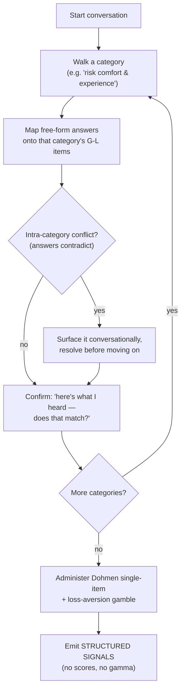

# Greenlight — Risk Elicitation Flow & Signal Fusion

**Status:** Design v2 · **Date:** 2026-05-31 · **Primary audience:** the teammate building the LLM-integration pipeline (+ the risk-profiler engine).

This document specifies (1) how the LLM elicits risk preferences in conversation and exactly **what structured output it must emit**, and (2) how the engine **fuses** those signals into the risk number γ. It is self-contained; read it alongside [02-research-foundations.md](./02-research-foundations.md) §2 (citations) and [05-contracts.md](./05-contracts.md) (object schemas).

**The one rule that governs everything here:** the LLM **elicits and confirms; it never computes a score, a γ, or an allocation.** It emits *structured signals*; the deterministic engine produces every number. This boundary is the contract firewall (§5) — it lets the front-end conversation evolve freely without destabilizing the risk model or optimizer.

---

## 1. What we measure (three independent, separately-validated instruments)

We triangulate risk *tolerance* from three instruments. Each is scored **on its own validated scale** and mapped to an implied γ **separately** — we never concatenate them into one questionnaire (that would void each instrument's published validity).

| Instrument | What it is | Native output |
|---|---|---|
| **Grable-Lytton 13** | The validated 13-item financial-risk-tolerance scale; 3 factors (investment risk, risk comfort/experience, speculative risk) drawn from 8 question categories. **Primary signal.** | 13 item responses (coded 1–4), summed 13–47 |
| **Dohmen single-item** | The validated SOEP general willingness-to-take-risk question. **Corroborator.** | integer 0–10 |
| **Loss-aversion probe** | One acceptable-gamble item ("smallest win to accept a 50/50 lose-$X bet"). **Behavioral flag.** | λ (≈ win/loss ratio) |

**Validity firewall (critical):** the Grable-Lytton score's published reliability (Cronbach's α≈0.77) and predictive validity (r≈0.60 vs. equity ownership), and its population norms (mean 28.27, SD 4.94), are **properties of those exact 13 items.** The LLM may **deliver** them conversationally but must **not** invent, reword, drop, or merge items — doing so creates a different, unvalidated instrument. Preserve the items → keep the validity and norms. (Capacity is measured separately; see [02 §3.1](./02-research-foundations.md).)

---

## 2. The conversational elicitation flow (LLM side)

The user never sees a rigid form. The LLM runs a natural conversation, **grouped by the instrument's categories**, mapping dialogue onto the validated items and confirming as it goes.



**Behavioral requirements for the LLM:**
- **Category-structured, conversational delivery.** Present each G-L construct naturally (the items are already abstract scenarios — "you've won a prize: $4,000 sure or a 50% shot at $10,000?"). Let the user explain situations; the LLM maps the explanation onto the item response.
- **Live, intra-category conflict resolution.** If two answers *within a category* contradict, surface it *then* and resolve it — do not defer to a global post-hoc check. (Cross-instrument disagreement is handled later by the engine's fusion, §3.)
- **Confirmation loop.** After each category, reflect back the inferred responses ("here's what I heard") and let the user correct. This is the documented response to the SEC's critique of questionnaires that ignore inconsistent answers.
- **Neutral framing.** Present gains and losses symmetrically; control item order; avoid leading language (framing effects materially shift elicited risk — see 02 §2).
- **No numbers out.** The LLM must not output a tolerance score, a γ, a volatility, or an allocation. It outputs only the structured signals below.

The gate inputs (debt, APR, mortgages/leases, income, expenses, emergency fund, horizon, ESG preferences) are collected in the **same conversation**, structured-with-optional-custom (present sensible options, let the user expand/override — the Claude-Code validation-prompt pattern).

---

## 3. The structured signal contract (LLM → engine)

The LLM emits this object (a sub-structure of `UserProfile`, see [05](./05-contracts.md)). It is the **only** thing the engine consumes from the conversation:

```
RiskSignals {
  gl_responses:        [int x13]     # Grable-Lytton items, each 1..4 (order fixed)
  dohmen_risk:         int 0..10     # single-item general willingness
  loss_aversion_probe: number        # smallest win to accept a 50/50 lose-$X bet
  per_signal_confidence: map<signal, 0..1>   # LLM's confidence it captured each correctly
  unresolved_flags:    [string]      # categories the user couldn't resolve in-conversation
}
```
Plus the gate inputs (`debts[]`, income, expenses, emergency_fund, horizon, age, esg_exclusions, …) per `UserProfile`.

---

## 4. The fusion (engine side — random-effects measurement fusion)

The profiler turns the three signals into one γ band. This is **inverse-variance / random-effects pooling** — standard measurement-fusion math, not a heuristic.

**Step A — map each instrument to a common latent γ, separately.**
- `γ₁` from Grable-Lytton via the score→percentile→γ map in [02 §2.1](./02-research-foundations.md) (population norms apply because the items are preserved), with `σ₁` from its SEM.
- `γ₂` from the Dohmen item via its own monotonic 0–10 → γ map, with `σ₂` from its published reliability.
- `γ₃` (and a λ flag) from the loss-aversion probe, with `σ₃` from its test-retest reliability.

**Step B — fuse on the γ scale (never on raw scores).**
- **Agreement → narrow band (inverse-variance weighting, the BLUE):**
  `γ* = Σ(γᵢ/σᵢ²) / Σ(1/σᵢ²)`, `Var₀ = 1/Σ(1/σᵢ²)`.
- **Disagreement → widen band (random-effects, DerSimonian-Laird):** add between-instrument variance `τ²`; weights become `1/(σᵢ²+τ²)`; combined variance grows with `τ²`. So conflicting signals automatically inflate uncertainty.
- **Conflict trigger (Cochran's Q):** `Q = Σ wᵢ(γᵢ − γ*)²`; if `Q` exceeds its χ²(k−1) critical value (or `I²` past a threshold) → **return a clarification request to the LLM** to re-ask, instead of producing a profile. *(With k=3 signals, treat τ²/Q directionally — coarse but principled — until we have more data.)*

**Step C — derive the band and the binding γ.**
- `gamma_tolerance = { aggressive: γ*−z·SE, mid: γ*, conservative: γ*+z·SE }` where `SE=√(combined variance)`. Disagreement widens SE → wider band automatically.
- **Capacity cap:** combine element-wise with `capacity_gamma` (02 §3.1): `gamma_band = max(gamma_tolerance, capacity_gamma)` (higher γ = less risk).
- **Loss aversion** shades the *allocation* conservatively when λ is high (panic-sell risk) — applied downstream in the optimizer, **not** folded into the score.

**Why this is valid, and what's still open:**
- **Form is rigorous:** inverse-variance weighting is the minimum-variance unbiased linear combiner (Gauss-Markov); random-effects τ² and Cochran's Q are the standard meta-analytic tools for heterogeneous estimates.
- **Parameters are calibrated, not asserted:** each `σᵢ` comes from the instrument's published reliability; the Q-threshold and conservative `z` are disclosed, tunable defaults.
- **Empirical validation is future work:** once we have our own users, backtest whether the fused γ predicts realized equity-holding better than any single signal (the r≈0.60 benchmark to beat). Until then we claim *principled*, not *empirically superior*.

---

## 5. The contract firewall (why front-end iteration is safe)

```
[ LLM conversation ] --emits--> RiskSignals + gate inputs --consumed by--> [ engine: fusion → γ band → gate → optimizer ]
        (free to evolve)                (STABLE CONTRACT)                        (untouched by UX changes)
```

As long as the LLM keeps emitting the `RiskSignals` contract (§3), the conversation — wording, ordering, how conflicts are surfaced, even the entire UI — can be redesigned **without changing the risk model or optimizer.** The fusion (§4) sits exactly at the boundary and converts signals → the γ band the engine already expects. The **only** change that would cascade downstream is altering the *measured content* (breaking the validated 13) — which §1's validity firewall forbids.

**For the LLM-integration teammate, the deliverable is therefore narrow and stable:** run the conversation in §2, preserve the items per §1, and emit the `RiskSignals` contract in §3. Everything after that is the engine's job.
